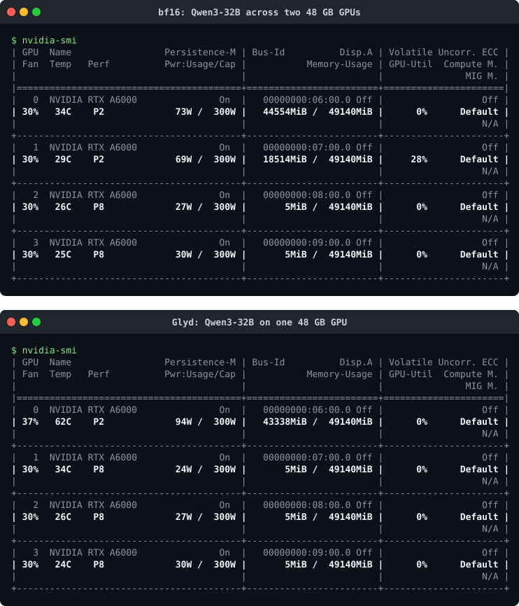
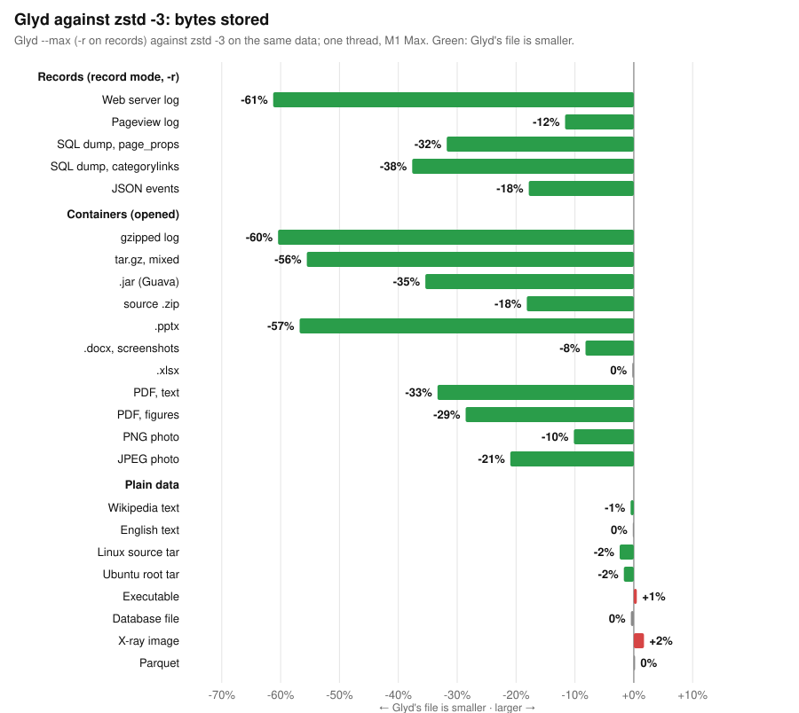

# Glyd: the long version

Everything about Glyd on one page: the GPU package, the codec, the store, and every measured result with
its log. The short version is [README.md](README.md); the same text, for LLMs, is
[getglyd.com/llms-full.txt](https://getglyd.com/llms-full.txt).

## AI models on fewer GPUs

Glyd holds a bf16 model's weights and KV cache in fewer bits in GPU
memory and rebuilds the exact values on the GPU as the model runs: the
model bit for bit ([docs](https://getglyd.com/docs/gpu/)).

```bash
pip install "glyd[gpu]"      # Linux x86_64 / aarch64, a CUDA GPU (Ampere or later), PyTorch for CUDA 12 or 13
```
```python
import glyd
model = glyd.from_pretrained("Qwen/Qwen3-8B")               # packed on the GPU as it loads: 11.2 GB of weights, not 16.4
model = glyd.from_pretrained("Qwen/Qwen3-8B", exact=True)   # logits bit for bit bf16's
# generate() runs compiled on PyTorch 2.13.0 or later (a static cache, CUDA graphs); compile=False, or GLYD_COMPILE=0, runs it eager
```
```bash
glyd pack Qwen/Qwen3-8B qwen3-8b-glyd                    # saved packed (glyd-v4; earlier saves still load), on the GPU: the Python tool's pack, as python -m glyd_gpu pack; glyd verify PATH checks a save
glyd pack Qwen/Qwen3-8B qwen3-8b-glyd12 --layout mma12   # the mma12 layout: an A10, A100 or H100 loads it as saved
```

<p align="center"></p>

<p align="center"><sub><code>nvidia-smi</code> during the runs: Lambda Cloud, 4x RTX A6000 (48 GB each), 2026-09-26. Raw output and every run's log: <a href="benchmarks/gpu/lambda-gpu_4x_a6000-20260926-084757">benchmarks/gpu/lambda-gpu_4x_a6000-20260926-084757</a>.</sub></p>

| The same runs | bf16 | ⚡&nbsp;**Glyd** |
| :--- | ---: | ---: |
| Qwen3-32B: weights | 65.5 GB | **44.5 GB** |
| Qwen3-32B: 48 GB GPUs it takes | 2 | **1** |
| Qwen3-32B: tokens/s at 1 / 8 / 32 sequences | 9.5 / 74 / 276 | **11.8 / 95 / 290** |
| Qwen3-32B: MMLU, 1,000 questions | 78.5% | 78.0% |
| Qwen2.5-72B: weights | 145.4 GB | **97.8 GB** |
| Qwen2.5-72B: 48 GB GPUs it takes | 4 | **3** |
| Qwen2.5-72B: tokens/s at 1 / 8 / 32 sequences | 4.5 / 35 / 135 | **6.4 / 49 / 154** |
| Qwen2.5-72B: MMLU, 1,000 questions | 81.9% | 81.8% |
| KV cache, Qwen2.5-7B, 16K tokens | 947 MB | **651 MB** |

What those runs cost, at Lambda Cloud's on-demand price for the GPUs
they ran on ($1.09 an RTX A6000-hour, 2026-09-26), from the tokens/s
measured:

| Around the clock | bf16 | ⚡&nbsp;**Glyd** |
| :--- | ---: | ---: |
| Qwen3-32B: GPUs, an hour | 2, $2.18 | **1, $1.09** |
| Qwen3-32B: a year | $19,097 | **$9,548** (−50%) |
| Qwen3-32B: a million tokens at 1 / 8 / 32 / 64 sequences | $63.74 / 8.14 / 2.19 / 1.24 | **$25.66 / 3.19 / 1.04 / 0.76** |
| Qwen2.5-72B: GPUs, an hour | 4, $4.36 | **3, $3.27** |
| Qwen2.5-72B: a year | $38,194 | **$28,645** (−25%) |
| Qwen2.5-72B: a million tokens at 1 / 8 / 32 / 64 sequences | $269.14 / 34.60 / 9.00 / 4.76 | **$141.93 / 18.54 / 5.91 / 4.16** |

(At 64 sequences Glyd's model on fewer GPUs makes fewer tokens a second
than bf16's, 400.5 against 488.4 for Qwen3-32B, and still costs less a
token.)

The same on every popular open model measured, and the same model
afterwards (every Linear layer's matrix packed and
unpacked bit for bit; perplexity on enwik8 and MMLU on 300 questions,
bf16 against Glyd in the same run; H100 SXM, 2026-09-26, and an A10 and
an H100 PCIe, 2026-09-27; logs in
[benchmarks/gpu/popular-h100-2026-09-26](benchmarks/gpu/popular-h100-2026-09-26),
[open-models-a10-2026-09-27](benchmarks/gpu/open-models-a10-2026-09-27) and
[lambda-gpu_1x_h100_pcie-20260926-213544](benchmarks/gpu/lambda-gpu_1x_h100_pcie-20260926-213544)):

| Model | Matrices in bf16 | ⚡&nbsp;**Glyd** | Perplexity, bf16&nbsp;→&nbsp;Glyd | MMLU, bf16&nbsp;→&nbsp;Glyd |
| :--- | ---: | ---: | ---: | ---: |
| GLM-4.5-Air 106B (MoE) | 215.9 GB | **144.6 GB** (−33.0%) | | |
| Llama 4 Scout 109B (MoE) | 211.9 GB | **142.2 GB** (−32.9%) | | |
| Qwen3-Next 80B-A3B (MoE) | 161.3 GB | **109.4 GB** (−32.2%) | | |
| Llama 3.3 70B Instruct | 136.9 GB | **91.9 GB** (−32.9%) | | |
| Qwen3 30B-A3B (MoE) | 59.8 GB | **40.2 GB** (−32.7%) | | |
| Gemma 3 27B | 51.5 GB | **34.6 GB** (−32.8%) | | |
| Muse Glimmer 30B | 51.3 GB | **34.5 GB** (−32.8%) | | |
| Qwen3.8 27B | 49.5 GB | **33.3 GB** (−32.8%) | 15.1946&nbsp;→&nbsp;15.1941 | 79.7%&nbsp;→&nbsp;80.0% |
| Gemma 4 26B-A4B (MoE) | 49.0 GB | **32.9 GB** (−32.8%) | | |
| Mistral Small 3.2 24B | 45.3 GB | **30.3 GB** (−33.0%) | | |
| Phi-4 (14B) | 27.3 GB | **18.3 GB** (−32.9%) | 14.7888&nbsp;→&nbsp;14.7855 | 76.7%&nbsp;→&nbsp;76.3% |
| DeepSeek-R1-Distill-Qwen 14B | 26.4 GB | **18.0 GB** (−31.9%) | 27.1955&nbsp;→&nbsp;27.1975 | 78.0%&nbsp;→&nbsp;78.0% |
| Gemma 3 12B | 21.8 GB | **14.6 GB** (−32.9%) | | 74.0%&nbsp;→&nbsp;74.0% |
| Llama 3.1 8B Instruct | 14.0 GB | **9.4 GB** (−32.8%) | 19.5915&nbsp;→&nbsp;19.5909 | 71.7%&nbsp;→&nbsp;72.0% |
| Mistral 7B Instruct v0.3 | 14.0 GB | **9.4 GB** (−32.7%) | 12.1422&nbsp;→&nbsp;12.1473 | 60.7%&nbsp;→&nbsp;60.7% |
| Qwen3 8B | 13.9 GB | **9.4 GB** (−32.1%) | 20.7490&nbsp;→&nbsp;20.7428 | 74.0%&nbsp;→&nbsp;74.3% |
| Qwen3 4B 2507 | 7.3 GB | **4.9 GB** (−32.2%) | 22.4636&nbsp;→&nbsp;22.4672 | 71.0%&nbsp;→&nbsp;71.0% |
| SmolLM3 3B | 5.6 GB | **3.8 GB** (−32.9%) | 29.1467&nbsp;→&nbsp;29.1422 | 63.3%&nbsp;→&nbsp;63.3% |
| Llama 3.2 3B Instruct | 5.6 GB | **3.8 GB** (−32.8%) | 25.1298&nbsp;→&nbsp;25.1437 | 63.7%&nbsp;→&nbsp;64.3% |

(Sizes in `mma`; `mma12` takes 23.5-24.8% off each. Quality
where the harness loads the model on one GPU in bf16: the MMLU answers
are bf16's on 98.0-100% of the questions. Gemma 3's perplexity is left
out: the harness's windows start without the BOS token Gemma needs, which
puts bf16 and Glyd alike near 12,000.)

- **Bit for bit.** Every weight and every cached key and value decodes to
  itself. The products sum in another order than cuBLAS's and
  FlashAttention's, as any two kernels do: MMLU answers are bf16's on
  98.0-100% of the questions, perplexity within 0.06% (Llama 3.2 3B
  25.1298 against 25.1437).
- **Speed.** Generating for 1 to 32 sequences at once is 1.05-1.42x
  bf16's tokens/s on the A6000s (the model on fewer GPUs) and 1.25-1.32x
  on an RTX 4080 SUPER. At 64 sequences it is 0.82-0.86x on the A6000s
  (1.04x on the 4080). Prompts take 1.2-1.6x bf16's time on the A6000s;
  on the 4080 up to 128 tokens as fast or faster, past that 1.05-1.10x.
  On an H100 `mma` takes more GPU time a token than bf16 (Qwen3-32B: 40.6
  ms against 28.2); `mma12` is the faster one there: Qwen3-32B in 49.2 GB
  instead of 65.5 at 26.4 ms of GPU time a token, its products at one
  token 1.1-1.2x faster than bf16's.
- **The limit.** No lossless code takes more than about 34% off bf16
  weights or KV cache (measured: 10.5-10.6 bits a value); Glyd's 10.80
  bits is 32.5% off. Models shipped in FP8 have about 18% to take, in
  NVFP4 about 7%.
- **On disk** a bf16 checkpoint is 33% smaller, a fine-tune against its
  base 44% smaller, and a training checkpoint with its optimizer state
  17-23% smaller (below).

### Serving with vLLM

```bash
curl -LsSf https://getglyd.com/install.sh | sh   # Glyd, vLLM 0.30 and PyTorch as one tool: Linux, an NVIDIA GPU, driver 580 or newer (on a Mac, or with no GPU: the compression program)
glyd run Qwen/Qwen3-8B                           # downloads the model, starts it packed, and opens a chat
```

`glyd run` checks the machine, works out the memory share, the context and
the parsers from the GPU it finds (a 16 GB card included), and chats in the
terminal and at http://localhost:8000; `glyd serve MODEL` leaves it up as an
OpenAI API, and `glyd doctor` says what this machine has and which models fit.
The steps, the settings and the manual `vllm serve` commands:
[getglyd.com/docs/vllm](https://getglyd.com/docs/vllm/#local-chat-like-ollama).
From v0.27 the GPU package, `glyd-gpu`, ships compiled; the install commands
are the same. It is under the Business Source License 1.1, as all of Glyd is
from v0.29.0 ([License](#license)). Its source up to v0.26 is in those
releases' tags.

vLLM holds the whole model packed: the Linears, from v0.28.0 the embedding
and the output layer too (every embedding row comes back bit for bit), and a
mixture of experts' experts, multiplied by Glyd's kernels; its KV cache takes
the memory they save. `vllm bench serve`, bf16 against Glyd at the same
`--gpu-memory-utilization 0.9` (servers warm, 1,024 tokens in and 256
out; low load 1 request a second, 0.25 on the L4), with v0.26.0's and
v0.27.0's plugin, before the embedding and the output layer were packed:

| GPU (Glyd's layout) | Model | KV cache | Requests/s, saturated | Low load: first token, each token | Saturated: first token, each token |
| :--- | :--- | ---: | ---: | :--- | :--- |
| L4 (`mma`) | Qwen3-8B | 1.89x | **1.33x** | +16%, −21% | −25%, +42% |
| A10 (`mma12`) | Qwen3-8B | 1.73x | **1.31x** | +16%, −21% | −25%, +30% |
| A100 40 GB (`mma12`) | Qwen3-8B | 1.14x | 0.98x | +19%, −10% | +9%, +17% |
| A100 40 GB (`mma12`) | Qwen3-14B | 1.77x | **1.28x** | +19%, −13% | −21%, +33% |
| GH200 (`mma12`) | Qwen3-8B | 1.04x | 0.93x | +6%, +1% | +5%, +9% |
| GH200 (`mma12`) | Qwen3-32B | 1.66x | 0.89x | +27%, −6% | −24%, +58% |
| H100 SXM (`mma12`) | Qwen3-30B-A3B | 2.11x | 0.84x (v0.28.0: 1.07x, below) | +35%, +5% | −37%, +126% |

2x RTX A6000: being re-measured after a benchmark fix (the benchmark's passes repeated prompts, so a large KV cache
could serve some of them; each pass now uses new prompts. The [CHANGELOG](CHANGELOG.md) has the corrected rows).

More requests at once on every GPU, and more a second on the L4, A10 and the A100 with Qwen3-14B; about the same on the
A100 with Qwen3-8B, and fewer a second saturated on the GH200 and, with v0.27.0's plugin, with Qwen3-30B-A3B on an H100 SXM. On an 80 GB H100 SXM, where
Qwen3-32B's bf16 weights leave room for 32,320 tokens of KV cache, Glyd
served 1.56x bf16's requests a second saturated (`fraction` 1, a bench of
its own: [docs](https://getglyd.com/docs/vllm/#a-fraction-of-the-layers)). At
low load the first token comes 6-35% later. `exact` gives vLLM's bf16
logits bit for bit, eager, or compiled in inductor's deterministic mode
where the packed Linears have no biases.
Options, exact mode, mixtures of experts, the checks against vLLM's bf16
and every rate: [getglyd.com/docs/vllm](https://getglyd.com/docs/vllm/); logs in
[benchmarks/gpu](benchmarks/gpu) (`l4-vllm-m5-2026-09-30` and
`l4-vllm-m5-new-prompts-2026-10-03`, `vllm-m3-a10-2026-09-30`,
`vllm-m3-a100-40gb-new-prompts-2026-10-03`, `vllm-m3-gh200-new-prompts-2026-10-03`,
`vllm-m6-h100-new-prompts-2026-10-03`).

#### The whole model, and mixtures of experts (v0.28.0)

The embedding and the output layer are packed too. On an L4, v0.27.0 from PyPI against v0.28.0 with the same vLLM 0.30.0, alternated in one session: the weights and
the KV cache as vLLM's log gives them with its own KV cache (`--max-model-len 4096`, 0.9 of the GPU's memory; a later start's), one user's tokens a second
(1,024 tokens in, 256 out, three rounds) and the requests a second saturated with `kv` at its default (`auto`, lossless on an L4; v0.28.0 against v0.27.0, two rounds):

| L4 | Weights GiB: bf16 | v0.27.0 | ⚡&nbsp;**v0.28.0** | KV cache tokens: bf16 | v0.27.0 | ⚡&nbsp;**v0.28.0** | One user, tokens/s: v0.28.0 against v0.27.0 | Requests/s saturated, v0.28.0 against v0.27.0 (two rounds) |
| :--- | ---: | ---: | ---: | ---: | ---: | ---: | ---: | ---: |
| Qwen3-8B | 15.27 | 11.38 | **10.38** (−32.0%) | 27,024 | 54,464 | **60,736** | **1.065x** | **1.095x and 1.095x** |
| Llama-3.1-8B | 15.0 | 11.05 | **10.16** (−32.3%) | 32,592 | 64,368 | **70,112** | **1.050x** | **1.040x and 1.041x** |
| Qwen3-4B | 7.56 | 5.48 | **5.16** (−31.7%) | 83,408 | 97,488 | **99,312** | **1.055x** | **1.031x and 1.037x** |

A first start, on an empty compile cache, no longer logs a much smaller KV cache than a later one (Qwen3-8B: v0.27.0 38,912 tokens against 54,464, v0.28.0 60,736 on both). The faster steps of the smallest layout alone, with the embedding and the output layer left as vLLM runs them, give one user 1.042x
v0.27.0's tokens a second on Qwen3-8B. `exact` is unchanged: vLLM's bf16 logits bit for bit. Logs: [benchmarks/gpu/vllm-v028-l4-2026-10-04](benchmarks/gpu/vllm-v028-l4-2026-10-04), and
[benchmarks/gpu/vllm-full33-l4-2026-10-03](benchmarks/gpu/vllm-full33-l4-2026-10-03) (the same on an earlier tree), [l4x2-vllm-tp2-2026-10-04](benchmarks/gpu/l4x2-vllm-tp2-2026-10-04)
(tensor parallel 2 over two L4s: every lookup and every product checked).

Mixtures of experts, against vLLM's own bf16 path with its default (untuned) MoE settings (a tuned bf16 would be faster than that baseline: not measured); `vllm bench serve`,
1,024 tokens in and 256 out, saturated, vLLM 0.30.0:

| Requests/s | bf16 | ⚡&nbsp;**Glyd** | Glyd with the lossless KV cache |
| :--- | ---: | ---: | ---: |
| H100 SXM, Qwen3-30B-A3B | 12.32 | **13.13** (1.07x) | **17.10** (1.39x) |
| A100 40 GB, Qwen3-16B-A3B | 4.12 | | **6.18** (1.50x) |

Qwen3-16B-A3B is Qwen3-30B-A3B with half its experts (the 30B does not fit an A100 40 GB in bf16). The weights leave room for more requests at once: the first token comes after 0.56x and 0.50x the
time on the H100 (0.53x on the A100) and each token takes 1.69x and 1.61x as long (2.04x). Prompt steps are where Glyd is behind (22 microseconds a prompt token against bf16's 15 on the H100). Logs:
[benchmarks/gpu/h100-moe-v028-2026-10-03](benchmarks/gpu/h100-moe-v028-2026-10-03), [a100-moe-v028-2026-10-03](benchmarks/gpu/a100-moe-v028-2026-10-03).

A newer model, Qwen3.8-27B (text only), on an H100 80GB HBM3 under vLLM 0.30.0: the weights take 38.77 GiB against bf16's 50.22 (−22.8%, the `mma12` layout this GPU takes by default) and
the KV cache holds 204,117 tokens against 122,538 (1.67x); saturated, 5.05 requests a second against 4.72 (**1.07x**); at 1 request a second each token takes 0.92x as long. Its
attention layers keep vLLM's own KV cache for now. Logs: [benchmarks/gpu/h100-qwen38-v028-2026-10-03](benchmarks/gpu/h100-qwen38-v028-2026-10-03).

### The lossless KV cache in vLLM

vLLM's KV cache held in fewer bits, every key and value read back bit for bit:
1.25x to 1.30x vLLM's tokens in the same memory on five models, and decoding
faster than with vLLM's own cache at every batch measured on an A100, an L4,
an H100 and a GH200.

```bash
vllm serve Qwen/Qwen3-8B --quantization glyd                   # kv auto, the default: on for an A100, an L4, an H100, a GH200
GLYD_KV=lossless vllm serve Qwen/Qwen3-8B --quantization glyd  # on any GPU it supports (or --additional-config '{"glyd": {"kv": "lossless"}}')
GLYD_KV=off vllm serve Qwen/Qwen3-8B --quantization glyd       # vLLM's own cache
GLYD_KV=auto glyd run Qwen/Qwen3-8B                            # glyd run keeps vLLM's own cache unless GLYD_KV is set
```

`auto` leaves vLLM's own cache on any other GPU, with a line in the log that
says so (an L40S, an RTX 40, an H200 and an A10 are not measured yet),
and where `exact` or `verify` is on; a window past 40,960 tokens keeps
vLLM's cache too. A first start sets the cache up once for the model (on an L4,
130 s for 8,192 tokens and 217 s for Qwen3-8B's whole 40,960-token window, kept
in `~/.cache/glyd/kv`), which is why `glyd run`, one user's chat, keeps vLLM's
cache unless `GLYD_KV` says otherwise; `glyd serve` and
`vllm serve --quantization glyd` use `auto`.

| Against vLLM's own cache, Qwen3-8B, default mode | KV cache | Decode tokens/s at the same batch | Requests/s, saturated (1,024 tokens in, 256 out) |
| :--- | ---: | ---: | ---: |
| L4 | 1.286x | 1.007x-1.053x | 1.23x |
| A100 SXM4 40 GB | 1.299x | 1.018x-1.032x | 1.29x |
| H100 SXM | 1.306x | 1.005x-1.197x | 1.05x |
| GH200 | 1.305x | 1.003x-1.187x | 1.06x |

On the L4 with Glyd's weights as well, it served 1.59x bf16's requests a second
saturated (1.20 against 0.76) with 2.64x the KV tokens (71,248 against 27,024).
On an H100 SXM with 8,192 tokens in and 256 out, saturated, it served 1.05x the
requests a second and the first token came after 0.89x the time, but each
generated token took 1.12x as long; on a GH200 the same run served 1.12x the
requests a second, with the first token after 0.95x the time and each token
0.97x as long. An H200 is not measured. Every value read back was the value
written (0 differ in every run); a decode step's attention is not bit-equal to
vLLM's, so greedy tokens can part from vLLM's after some tokens. Logs in
[benchmarks/gpu](benchmarks/gpu):
`l4-vllm-kv-step-2026-10-02`, `l4-vllm-kv-graphs-2026-10-01`,
`a100-vllm-kv-step-2026-10-02`, `a100-vllm-kv-prefix-2026-10-02`,
`h100-vllm-kv-2026-10-02`, `gh200-vllm-kv-2026-10-03`,
`l4-vllm-kv-window-2026-10-02` and `l4-vllm-kv-wait-2026-10-02`.

### Related work

Lossless compression of bf16 weights is not new; what Glyd adds is the
combination below.

- [DFloat11](https://arxiv.org/abs/2504.11651) (Zhang et al., NeurIPS
  2025): Huffman codes for the exponent, about 30% smaller, outputs bit
  for bit; each transformer block is decompressed to bf16 before it
  runs, which its authors report as about 2x bf16's time at one sequence.
- [ZipServ](https://arxiv.org/abs/2603.17435) (ASPLOS 2026): a
  fixed-length bitmap code decoded straight into tensor-core registers
  inside the product, up to 30% smaller, up to 2.21x cuBLAS's speed per
  product and 1.22x vLLM's end to end on GDDR GPUs.
- [Approaching Shannon Bound with Lossless LLM Weight Compression](https://arxiv.org/abs/2606.15789)
  (Tan et al., ISCA 2026): ANS codes within 0.01-0.05 bits of the
  entropy bound for bf16, fp8 and integer formats, decoded a tile at a
  time in SGLang.
- [SplitZip](https://arxiv.org/abs/2605.01708) (2026): lossless coding of
  the KV cache, for moving it between servers.
- [ZipNN](https://arxiv.org/abs/2411.05239) (2024) and
  [NeuZip](https://arxiv.org/abs/2410.20650) (2024) for storage and
  training memory, [Huff-LLM](https://arxiv.org/abs/2502.00922) (2025)
  in hardware, [lossless compression of weights, checkpoints and K/V
  caches in low-precision formats](https://arxiv.org/abs/2508.19263)
  (2025), and Cloudflare's [Unweight](https://research.cloudflare.com/papers/unweight-2026.pdf)
  (2026) for MLP weights.

Where Glyd differs: 10.80 bits a weight (32.5% off; the others: about
30%, or at the bound with an ANS decoder); the KV cache held compressed
(31%); the same result every run; the model on disk, fine-tunes against
their base and training checkpoints.

Side by side on one GPU, an RTX 4080 SUPER (16 GB), with Qwen3-8B, whose
16.38 GB of bf16 does not fit it ([benchmarks/gpu/head-to-head-rtx4080s-2026-09-26](benchmarks/gpu/head-to-head-rtx4080s-2026-09-26)):

| Qwen3-8B, RTX 4080 SUPER | DFloat11 | ⚡&nbsp;**Glyd**, `mma` | Glyd, `mma12` |
| :--- | ---: | ---: | ---: |
| Weights in GPU memory | 11.16 GB | **11.15 GB** | 12.27 GB |
| Tokens/s at 1 / 8 / 32 / 64 sequences | 13.8 / 104.7 / 387.5 / 746.2 | **47.2 / 360.2 / 1268.6** / 1897.2 | 45.9 / 350.9 / 1259.9 / **2150.8** |
| GPU time a token at 1 / 8 / 32 / 64 sequences | 71.4 / 74.9 / 79.9 / 81.4 ms | **19.8 / 20.6 / 22.9** / 30.6 ms | 20.4 / 21.3 / 23.2 / **26.6** ms |

DFloat11 decodes each transformer block's weights to bf16 before the
block runs (47 ms of every token here). ZipServ ships its product as a
kernel (end to end it runs inside its own vLLM), so product against
product, on layer 18's matrices, timed as ZipServ times itself (the L2
cache flushed before every call), ZipServ at its best split of K; Glyd's
`mma` at 1-32 tokens, `mma12` (12.04 bits) at 64:

| Qwen3-8B, layer 18, us | Bits a weight, ZipServ / Glyd | 1 token: cuBLAS / ZipServ / Glyd | 16 tokens | 32 tokens | 64 tokens |
| :--- | ---: | ---: | ---: | ---: | ---: |
| q_proj, o_proj (4096 x 4096) | 11.35 / **10.81** | 73 / 57 / **56** | 73 / **57** / 58 | 74 / **58** / 62 | 77 / **69** / 73 |
| k_proj (1024 x 4096) | 11.43 / **10.83** | 23 / 22 / **19** | 27 / 23 / **21** | 26 / **23** / 24 | 28 / **25** / 30 |
| gate_proj (12288 x 4096) | 11.35 / **10.76** | 175 / 151 / **144** | 204 / 152 / **148** | 235 / 155 / **153** | 225 / **162** / 172 |
| down_proj (4096 x 12288) | 11.35 / **10.75** | 176 / 153 / **147** | 208 / 154 / **150** | 228 / 155 / **153** | 214 / 187 / **181** |

So: DFloat11's size at 2.9-3.4x its speed. Against ZipServ, 5% fewer
bytes; at 1 to 16 tokens as fast or faster (within 2%), at 32 and 64
tokens behind it on most matrices, by up to 20%.

---

## At a glance

Underneath the GPU work, **Glyd** is a lossless compression library and CLI, written in Rust with a
C ABI, for the workloads where storage and read CPU decide the bill:
object storage, data lakes, logs and telemetry, backups and versioned
exports, RPC payloads, caches. It is a drop-in alternative to **LZ4**,
**Snappy** and **zstd**, and it does two things they do not: it turns
record-shaped data (logs, dumps, CSV, JSON lines) into typed columns
before compressing (`-r`), and it compresses a new version of an object
against the old one (`--base`).

Every number in this README is measured on public data, every decode
compared byte for byte with its input, against the reference codec on the
same machine and thread count in the same run. The full program and its
results: [docs/benchmarks/suite-2026-09-21.md](docs/benchmarks/suite-2026-09-21.md).

**The table everyone uses** — the 8.7 GB real-data corpus (logs, JSON
events, SQL dumps, Parquet) on AWS Graviton3, ratio · compress MB/s ·
decompress MB/s. One core, the way zstd's own README reports:

| Codec | Ratio | Compress MB/s | Decompress MB/s |
| :--- | ---: | ---: | ---: |
| LZ4 | 2.72 | **504** | 1,394 |
| ⚡&nbsp;**Glyd&nbsp;default** | 2.82 | 332 | **3,309** |
| zstd&nbsp;-3 | 3.86 | 313 | 1,425 |
| ⚡&nbsp;**Glyd&nbsp;‑‑max** | **3.98** | 233 | **1,571** |

Eight cores, what a server does (Glyd's output decodes in parallel; a
zstd or LZ4 frame decodes on one thread):

| Codec | Ratio | Compress MB/s | Decompress MB/s |
| :--- | ---: | ---: | ---: |
| ⚡&nbsp;**Glyd&nbsp;default** | 2.82 | **2,143** | **22,707** |
| zstd&nbsp;-3&nbsp;-T8 | 3.85 | 1,969 | 1,422 |
| ⚡&nbsp;**Glyd&nbsp;‑‑max** | 3.94 | 1,512 | **10,413** |
| ⚡&nbsp;**Glyd&nbsp;‑‑max&nbsp;‑r** | 4.71 | 643 | **4,040** |
| LZ4 | 2.72 | 503 | 1,392 |
| zstd&nbsp;-19&nbsp;-T8 | 4.66 | 13 | 1,326 |
| ⚡&nbsp;**Glyd&nbsp;‑‑ultra** | 4.66 | 14.5 | **9,620** |
| ⚡&nbsp;**Glyd&nbsp;‑‑ultra&nbsp;‑r** | **5.22** | 20 | **3,927** |

In one line: Glyd reads 3–7× faster than zstd on a server and stores 10–70%
less where the data has structure; it writes at 0.77× zstd -3's speed
(record mode 0.33×). For data written once and read many times that is the
right side of the trade; for data written constantly and rarely read,
zstd -3 or LZ4 still win on write cost.

- 🏪 **The store (`glyd-store`)**: `put` an object and it is kept as a delta against the stored object it most resembles, when that pays; a read is at most five decodes. A 39 GB bucket (six Ubuntu image builds, fifteen kernel releases, two months of Wikipedia tables, twelve hours of GitHub events) stores in 1,334 MB against zstd -3's 6,132 MB: **4.6× fewer bytes**, put at 500 MB/s end to end, every object read back byte-exact.
- 🗂️ **Record mode (`-r`)**: logs, SQL dumps, CSV and JSON lines as typed columns; logs of varying shape as templates plus typed variables. Telemetry stores 2.5–3.5× less than zstd -3 and 1.5–2× less than zstd -19; application and system logs 1.4–3.3× less than zstd -3 and 1.1–2.1× less than zstd -19; the whole corpus 19% less than zstd -3.
- 📦 **Packs (`--pack`)**: many small objects as one record-mode stream with an index; 2–4× fewer bytes than zstd + dictionary per object, any one object read back in a millisecond.
- 🧩 **Shape dictionaries (`--shape`)**: record mode for a single small object. Trained on a sample; a 1–4 KB event or log object stores 1.1–1.9× less than with a zstd dictionary.
- 🧊 **Cold level (`--cold`)**: context mixing for what is stored for years and read rarely. 1.5–2.6× fewer bytes than zstd -19 on logs, dumps, JSON and text — the zpaq -m5 class at 3–4× its speed — at 1.2–1.5 MB/s per core each way.
- 🧠 **Model weights**: safetensors and GGUF files coded tensor by tensor by their element types (bf16, f16, fp8, ggml's quantised blocks): 22 files cut from 2026 models are 31.8% smaller, zstd -19 24.8%, xz -9 26.7% ([benchmarks/weights/model-files-2026-10-05](benchmarks/weights/model-files-2026-10-05)); earlier, Pythia-410M 13% under zstd -19 at 26× its write speed, Qwen2.5-0.5B 12% under. A checkpoint against the one before it (`--base`) stores in 612 MB where `zstd -19 --patch-from` stores 805. PyTorch training checkpoints with optimizer state: 83% of their size alone, 77% against the one before (zstd -19: 92%). On the GPU ([docs](https://getglyd.com/docs/gpu/)) the weights stay compressed in memory, bit for bit: a 7B model in 10.6 GB instead of 15.3 (its matrices 32.5% smaller), generating 1.25–1.32× faster than bf16 from 1 to 32 sequences at once (1.04× at 64), prompts up to 128 tokens as fast or faster and longer ones within 5–10%.
- 🔁 **Base mode (`--base`)**: a new version against the old one, its content found wherever it moved. Dumps, images and source trees at 1–5% of their plain size; 1.1–2.1× less than `zstd --patch-from` at the fast tier, at 1.8–3× its speed; 15 kernel releases in 228 MB instead of 3 GB.
- 🔭 **128 MB long-distance matcher** (`--max --long`, `--ultra`, the store): JSON events 22% smaller than zstd -3, 10% smaller than zstd -19.
- 🚀 **Fastest reads at every ratio**: 8-way interleaved entropy coding and copy-only loops, units that decode one per core.
- 🛡️ **Verified**: 98 tests, a million-mutation fuzz per run, every earlier format decoded unchanged, the CLI round-tripped with corrupted copies on both AWS machines.
- 🔌 **Rust, C ABI, CLI**, streaming `std::io` adapters, trained dictionaries for small objects.

---

## What Glyd saves you

> **Try it:** [surya-koritala.github.io/Glyd/savings.html](https://surya-koritala.github.io/Glyd/savings.html) — enter what you store and what you compress with today.

Bytes stored, against zstd on the same data (measured; the sign is what
matters):

| Data | vs zstd -3 (the fast tier) | vs zstd -19 (the slow tier) |
| :--- | ---: | ---: |
| **A bucket of versioned objects** — images, releases, dumps, events (`--store`) | **−78%** (2.0–13.9× by family; events, with nothing to share, −23%) | |
| **Versions** of a dump, image or source tree (`--base`) | **−45 to −53%** vs zstd's fast patch; **−95 to −99%** vs the version alone | −5 to −21% (`--ultra`) |
| **Telemetry, measurements** as CSV or JSON lines (`-r`) | **−60 to −71%** | **−33 to −52%** |
| **Application and system logs** (HDFS, Spark, BGL, Android; `-r`) | **−28 to −69%** | **−9 to −53%** |
| **Cold archives** of logs, dumps, JSON, text (`--cold`, 1 MB/s per core) | **−52 to −69%** | **−32 to −62%** |
| **Small objects** (events, log and CSV objects of 1–4 KB) packed (`--pack`) | **−48 to −75%** vs zstd + dictionary per object | |
| **Access logs** (`-r`) | **−55%** | **−35%** |
| **SQL dumps** (`-r`) | **−41%** | **−30%** |
| **JSON events** (API payloads with hashes) | **−22%** | −10% |
| Whole mixed corpus (`-r`) | **−19%** | −10% |
| **Parquet** with snappy or zstd pages (opened, the values modeled) | **−31 to −44%** of the file (zstd -19 gets 1%) | **−35%** (`--ultra`, against zstd -19 on the file) |
| Plain text, binaries | ~0% | ~0% (the floor; nothing moves it) |

A terabyte kept a year in S3 Standard, compressed once and read once a
month (Graviton3, CPU billed at the on-demand price): `--max -r` **$61.7**
against zstd -3's $73.3 and zstd -19's $102; at ten reads a month
`--max` **$81.3**, `--max -r` $82.4, zstd -3 $84.1; at a hundred reads a
month `--max` **$178** against zstd -3's $191 (its reads now cost less
CPU than zstd's), while `--max -r` is $289: record-mode reads spend 2×
the CPU rebuilding the columns
([report](docs/benchmarks/suite-2026-09-21.md)). At the scale of
object storage (hundreds of exabytes) every 1% fewer bytes is about $250
million a year at list price; the percentages above are what to multiply.

---

## Quick start

```bash
brew install surya-koritala/glyd/glyd        # macOS / Linux: the glyd and glyd-store CLIs, glyd.h
pip install glyd                             # Python: Linux x86_64 / aarch64, macOS arm64 (PyPI)
pip install "glyd[gpu]"                      # models on the GPU: Linux x86_64 / aarch64 (glyd.from_pretrained)
cargo install --git https://github.com/surya-koritala/Glyd glyd glyd-store   # from source
```

Every [release](https://github.com/surya-koritala/Glyd/releases) carries
the CLIs, the shared and static libraries and `glyd.h` for Linux
x86_64, Linux aarch64 and macOS arm64, plus a Python wheel for each.
Bindings: [Python](bindings/python/README.md), [Go](bindings/go/glyd.go)
(cgo over `include/glyd.h`), C (`include/glyd.h`). Formats:
[docs/spec.md](docs/spec.md). lzbench: `contrib/lzbench/setup.sh <checkout>`.

```bash
glyd --max  events.json -o events.glyd            # the zstd -3 slot: fewer bytes, 3-7x faster reads
glyd --max -r access.log -o access.glyd           # record mode: logs, dumps, CSV, JSON lines as columns
glyd --ultra -r dump.sql -o dump.glyd             # fewest bytes from a parse; slow to write
glyd --cold -r dump.sql -o dump.glyd              # fewest bytes of all; 1 MB/s per core each way
glyd-store bucket/ --put mon.tar tue.tar wed.tar  # the store finds each object's base itself (glyd-store crate)
glyd-store bucket/ --get 2 -o wed.tar            # also --find NAME, --delete ID, --rebase ID, --compact, --verify, --stats
glyd-store meta/ --s3 s3://bucket/prefix --put wed.tar     # objects in S3 (or any S3-compatible service)
glyd-store --audit s3://bucket/prefix            # what the store would save there, from a sample, in dollars
glyd --base dump-mon.sql dump-tue.sql -o tue.glyd # base mode: Tuesday's dump against Monday's
glyd -d --base dump-mon.sql tue.glyd -o tue.sql   # decoding a base-mode file needs the base
glyd    telemetry.bin -o telemetry.glyd           # default: LZ4-class ratio, 22 GB/s reads on 8 cores
glyd -d events.glyd -o events.json                # the level and mode are in the stream
glyd -b bigfile                                   # benchmark every level on your data
```

Rust:

```rust
let mut out = Vec::new();
glyd::compress_parallel_into_max(&input, &mut out);   // or compress_into_max, _ultra, _cold, compress_into (default)
let back = glyd::decompress_parallel(&out)?;          // any level, any block mix

glyd::compress_records_into_max(&log, &mut out);      // record mode (-r); decompress() reads it
glyd::compress_with_base(&old, &new, &mut out, false);// base mode; decompress_with_base(&old, &out)
let mut store = glyd_store::Store::open("bucket/")?;   // the glyd-store crate: put finds the base, get rebuilds
let id = store.put("wed.tar", &data)?;  let back = store.get(id)?;
```

```python
import glyd                                   # bindings/python
c = glyd.compress(data, records=True)         # decompress(c); pack(objects); Store("bucket/").put(name, data)
glyd::decompress_stream(&out, |batch| file.write_all(batch))?;   // batches of units, bounded memory

// Dictionaries for small objects: train once on samples, keep the bytes.
let dict = glyd::Dict::train(&samples, 110 * 1024);
glyd::compress_with_dict(&dict, &doc, &mut out);      // or compress_with_dict_ultra
let back = glyd::decompress_with_dict(&dict, &out)?;
```

C / C++ / Go / Python (ctypes): link `libglyd` and include [`include/glyd.h`](include/glyd.h):

```c
size_t cap = glyd_max_compressed_len(n);
int64_t clen = glyd_compress_max_parallel(src, n, dst, cap);   // or glyd_compress / _parallel
int64_t dlen = glyd_decompress_parallel(dst, clen, out, n);
```

---

## Levels and modes

| Level | Use it for | How it works |
| :--- | :--- | :--- |
| **‑‑turbo**&nbsp;(‑t) | Data read far more often than written: caches, assets, KV-cache paging | v6 format, minimum match 10: fewest tokens, one 32-byte copy per token |
| **default** | The LZ4/Snappy slot with a better ratio and faster reads | v6 format, LZAV-class finder, minimum match 7 |
| **‑‑fast**&nbsp;(‑1) | LZ4-class compression speed | v6 format, LZ4-class finder, minimum match 5 |
| **‑‑max**&nbsp;(‑9) | The zstd -3 slot: fewer bytes, 3–7× faster reads on a server | v9 format: 8-way interleaved Huffman literals, tANS sequences with repeat offsets, a double-fast parse over an 8 MB window (zstd -3's, one rule stricter), blocks cut where the bytes' statistics change |
| **‑‑max&nbsp;‑‑long**&nbsp;(‑L) | Events, logs, anything that repeats itself across an input | The same, with a 128 MB long-distance matcher run once before the parse (as `zstd --long`): 3–29% fewer bytes on events and logs, at a third more write time |
| **‑‑max&nbsp;‑‑dense**&nbsp;(‑D) | Objects written once and read rarely (the store's) | `--long`, in 128 MB units parsed in stripes on all cores: one core's bytes at any core count, 5–9% fewer on files of a few hundred MB; reads scale only with the units |
| **‑‑ultra**&nbsp;(‑19) | Write once, read many: datasets, release assets | v9 format on an optimal parse: binary-tree finder, every position priced in the coder's own bits ([design](docs/design/ultra-parse.md)) |
| **‑‑cold**&nbsp;(‑C) | Stored for years, read rarely: archives, compliance holds, the last copy | Context mixing: every bit predicted from eleven contexts (byte orders, the word, the column, the JSON key, the longest earlier match) with bit histories, mixed by two small networks, coded arithmetically; 32 MB units in parallel, 1–1.3 MB/s per core each way ([design](docs/design/format-v7.md#the-cold-level-context-mixing)) |

| Mode | Use it for | How it works |
| :--- | :--- | :--- |
| **‑r** record mode | Logs of any shape, SQL dumps, CSV/TSV, JSON lines | Detects the shape (delimited lines, dumps, JSON lines, or templates for logs of varying shape), turns each field, key path or template slot into a typed stream (integer, decimal and date-time deltas, dictionaries with recency ranks, text), compresses those with the level in 32 MB units, rebuilds exactly ([design](docs/design/format-v7.md#record-mode-v040-typed-columns-before-the-level)) |
| **‑‑base** base mode | Versions: nightly dumps, snapshots, images, source trees | Parses each 32 MB of the new version with the region of the old one that holds its content (found through a coarse map of the base) as history; the stream decodes with the same base ([design](docs/design/format-v7.md#base-mode-v050-a-version-compressed-against-the-last-one)) |

All levels write one container; the decoder reads any mix. Blocks are
256 KB; the parallel paths cut the input into units (one per core, up to
128 MB) that compress and decode independently. The CLI decodes a batch of
units at a time into one reused buffer, so its memory is a batch, not the
file.

---

## Real data, real machines

The verification and benchmark program: 8.7 GB of logs, JSON events,
SQL dumps and Parquet; zstd -3, zstd -19 and LZ4 on the same AWS machines
(Graviton3 c7g.2xlarge and Sapphire Rapids c7i.2xlarge) and thread counts;
small objects with dictionaries trained on other days' data; a real S3
round trip (compress, upload, download, decompress, sha256) costed at list
prices. Method: [docs/benchmarks/README.md](docs/benchmarks/README.md);
results with every table: [docs/benchmarks/suite-2026-09-21.md](docs/benchmarks/suite-2026-09-21.md);
raw rows: [benchmarks/suite/](benchmarks/suite/).

The short version: `--max` stores 2.2% less than zstd -3 over the corpus
(24% less on JSON events), decodes 3–7× faster with 8 cores and 1.10×
(Graviton3) / 0.85× (Sapphire Rapids) on one core, and compresses at
0.71–0.77× zstd -3's speed. `--ultra` equals zstd -19 (10% smaller on
JSON). `--max -r` stores 18% less than zstd -3 and 1% less than zstd -19
at 500–645 MB/s on 8 cores; `--ultra -r` 11% less than zstd -19.

## Against zstd, xz and brotli on 24 kinds of data

Every codec's own CLI on one thread, every decode compared byte for
byte with its input. Green: Glyd's file is smaller.



| Data | vs zstd -3 (`--max`) | vs zstd -19, xz, brotli -11 (`--ultra`) |
| :--- | :--- | :--- |
| Records: logs, dumps, JSON (`-r`) | **12–61% fewer bytes** | **3–38% fewer** (JSON: 9% more) |
| Containers: gzip, zip, Office, PDF, PNG, JPEG | **up to 60% fewer** | **14–63% fewer** |

Glyd wins where the data has structure: each field of a record becomes
a column, and the deflate or JPEG inside a container is opened and
re-created bit for bit. On plain text and executables it is
zstd-class: within 2% at the fast tier, 1–15% larger than xz and
brotli -11 at their strongest. Every codec's speed, the strong-tier
and ratio-against-speed charts, and lz4, bzip2, zpaq and JPEG XL:
[docs/benchmarks/landscape-2026-09-22.md](docs/benchmarks/landscape-2026-09-22.md).

## The store: compression across objects

Inside one object every codec sits on the same floor: on plain bytes
zstd -19, xz and Glyd `--ultra` land within 5% of each other, and the
levers that beat it (columns, base mode, context mixing) each take a
kind of data. The redundancy of object storage is elsewhere — between
objects. A bucket holds builds, snapshots, dumps and releases that are
near-copies of earlier ones, and a codec that sees one object at a time
cannot know it.

The store is its own crate, `glyd-store` (`glyd-store DIR --put ...`).
`put` keeps an object as a delta against the stored object it most
resembles when that pays, and otherwise on its own at `--max` (record
mode where it pays; `--ultra` or `--cold` on request). A read is at most
five decodes at 6–10 GB/s; `rebase(id)` stores an object read often
alone again. `get`, `id_of(name)`, `delete` (the bytes another object
still needs stay), `compact` (frees what no live object needs), `verify`
(every object read back and checked). The objects' bytes go through a
`Backend`: a directory, or an S3 bucket over HTTPS (`--s3
s3://bucket/prefix`, or any S3-compatible service through
`AWS_ENDPOINT_URL`). Metadata stays local, and `--rebuild` remakes a lost
metadata directory from the objects alone. Measured on a realistic bucket
(`scripts/download_bucket.sh`, 39 objects, 39.2 GB, each arriving in
order), every object read back and compared:

| Family | Raw | zstd -3, each object alone | ⚡&nbsp;**Glyd store** | **Gain** |
| :--- | ---: | ---: | ---: | ---: |
| Linux 6.10 releases (15) | 22.5 GB | 3,237 MB | **232 MB** | **13.9× smaller** |
| Ubuntu 24.04 cloud images (6 builds) | 6.6 GB | 1,880 MB | **361 MB** | **5.2×** |
| Wikipedia dumps (2 months, 3 tables) | 0.7 GB | 140 MB | **71 MB** | **2.0×** |
| GitHub events (12 hours) | 9.4 GB | 875 MB | 670 MB | 1.3× (no object is a version of another) |
| **The bucket** | **39.2 GB** | **6,132 MB (6.4×)** | **1,334 MB (29.4×)** | **4.6× smaller** |

At a terabyte ([report](docs/benchmarks/store-gate-2026-09-24.md)):
1,192 objects, 1.18 TB — 400 kernel point releases, every hour of
GitHub events in January 2024, five English Wikipedia dumps' tables,
six Ubuntu images — put through the store into S3 from one 16-vCPU
instance next to the bucket, every object read back and compared
byte for byte, then the whole bucket restored by one process and
compared again (an earlier run also deleted the metadata directory,
rebuilt it from the bucket and verified): **43.61 GB stored against
zstd -3's 153.5 GB, 3.52× fewer bytes (27.2× against raw)** in
v0.14.9; kernel releases 286–425× against raw, Wikipedia tables
20.9×, hourly events 14.1× (record mode alone). Put ran at 374 MB/s
(243 in the 2026-09-22 run), read-back one object at a time at 486
MB/s (zstd -3's own read-back on the same instance: 346 MB/s) and the
restore at 559 MB/s, S3 included, on that instance.

Put runs at 620 MB/s end to end over the bucket on ten cores (a version
of the last object put runs at 900 MB/s); verifying the whole bucket
reads it back at 1.5 GB/s. On a Ryzen 9 7950X3D (16 cores, v0.14.7) a
kernel release arriving as a version of the last one is put at 1,224 MB/s
and read back at 1,590; the first of them, alone, at 2,545 MB/s; an
Ubuntu root filesystem with gzip inside as a version at 215 MB/s (the
deflate emulation's speed). The same store built on zstd's own
`--patch-from` would land around 3–4×: our deltas are 1.1–2.1× smaller
and read 10× faster. In money, a petabyte of such data in S3 Standard
costs $43K a year with zstd -3 and $9.4K with the store. Chunk-level
dedup, what backup systems do, gains 1–4× on the same pairs. The store's
memory does not grow with what it holds. Objects under 256 KB are
gathered into 2 MB packs (record mode where it pays) and `get` decodes
the pack and slices: 2,000 GitHub events put one by one store at 9.0×
against zstd -3's 3.6× per event.

## Base mode: a version compressed against the last one

Most stored bytes are versions: nightly dumps, snapshots, images,
source trees, artifacts rebuilt with small changes. A new version
compressed alone costs what the first did; compressed against the old
one it costs the change. `glyd --base old new` parses every 32 MB of
the new version with the region of the old one that holds its content
as history (the long-distance matcher reaches all of it) and writes a stream that
decodes with the same base: `glyd -d --base old new.glyd`. Measured on
consecutive versions of real objects against zstd 1.5.7's
`--patch-from`, the same machine and thread count, every rebuild
byte-exact (`scripts/bench_versions.sh`, data from
`scripts/download_versions.sh`):

| Old → new | zstd -3 --patch-from | zstd -19 --patch-from | ⚡&nbsp;**Glyd&nbsp;‑‑max&nbsp;‑‑base** | **Glyd&nbsp;‑‑ultra&nbsp;‑‑base** |
| :--- | ---: | ---: | ---: | ---: |
| Wikipedia `page` dumps a month apart (108 MB) | 3.84 MB · 409 MB/s | 1.30 MB · 2 MB/s | **1.79 MB · 720 MB/s** | **1.23 MB** · 6 MB/s |
| Ubuntu 24.04 cloud root filesystem, builds 16 days apart (1.1 GB) | 8.82 MB · 654 MB/s | 5.61 MB · 39 MB/s | **5.33 MB · 1,590 MB/s** | **4.60 MB** · 11 MB/s |
| Linux 6.10 → 6.10.1 source tar (1.5 GB) | 3.26 MB · 560 MB/s | 2.58 MB · 30 MB/s | **3.03 MB · 1,700 MB/s** | **2.04 MB** · 3 MB/s |

Compressed alone with `--max` those versions are 33, 287 and 200 MB.
`--max --base` stores 1.1–2.1× less than zstd's fast patch at 1.8–3×
its speed, and on the image pair less than zstd's slow patch at 40×
its speed; `--ultra --base` stores 5–21% less than zstd -19's patch on
every pair at the plain `--ultra` speed, which is 3–10× slower than
zstd -19's patch on the large pairs. Reads run at 6–10 GB/s. Content
is found wherever it moved: each unit's region of the base is chosen
from a coarse map of the base (one anchor per KB), so a version with
48 MB inserted before the kernel tree still costs 18.4 MB (zstd -3
--patch-from 18.7; a fixed window around the unit's own position,
33.5). Chunk-level dedup, the backup approach, gains 1–4× on the same
pairs ([experiments/structure/README.md](experiments/structure/README.md)).

Over a chain of versions, the Linux 6.10 point releases (15 versions
of a 1.5 GB tree; `scripts/download_chain.sh`, `scripts/bench_chain.sh`),
each version against the one before it, or against 6.10 alone so that
any version is two reads:

| Stored | Glyd --max --base | zstd -3 --patch-from | Stored one by one |
| :--- | ---: | ---: | ---: |
| 6.10 plus 14 point releases, each against the previous | **228 MB** | 260 MB | Glyd --max 3,000 MB · zstd -3 3,236 MB |
| the same, each against 6.10 | **246 MB** | 265 MB | |

A step costs 1.8 MB (0.12% of the tree; 3.0–3.1 MB when the release
number grows a digit, which touches every path in the archive) and
the delta against a base 14 versions old costs 3.6 MB, so rebasing
inside a release series is not needed. A terabyte of such trees in
S3 Standard ($276 per stored TB-year) costs $37 a year compressed one
by one with `--max` ($40 with zstd -3) and $2.8–3.0 with base mode
($3.2–3.3 with zstd's patch).

## Record mode: logs and table dumps as columns

Byte-level matching is a plateau: on real data zstd -19, xz and Glyd
`--ultra` land within a few percent of each other. The redundancy of a
log or a table dump is not in nearby bytes but in the same field of
every record. `glyd -r` (record mode, [design](docs/design/format-v7.md#record-mode-v040-typed-columns-before-the-level))
detects delimited lines, SQL dumps and JSON lines, turns them into one
typed stream per field or key path (integer, decimal and date-time
deltas, dictionaries with recency ranks, text), compresses those with
the chosen level in parallel 32 MB units, and rebuilds the bytes
exactly. Anything else is left as it is.

The 8.7 GB benchmark corpus, 10 cores, every decode byte-checked
(`examples/bench_suite.rs`, rows in [`benchmarks/suite/m1-max-v0.4.0/`](benchmarks/suite/m1-max-v0.4.0/)):

| Data | Glyd&nbsp;‑‑max | Glyd&nbsp;‑‑ultra | ⚡&nbsp;**Glyd&nbsp;‑‑max&nbsp;‑r** | ⚡&nbsp;**Glyd&nbsp;‑‑ultra&nbsp;‑r** | zstd&nbsp;-3 | zstd&nbsp;-19 | **‑‑ultra&nbsp;‑r vs zstd&nbsp;-19** |
| :--- | ---: | ---: | ---: | ---: | ---: | ---: | ---: |
| SQL dumps (3.9 GB) | 4.96 | 6.98 | **8.38** | **10.14** | 4.97 | 7.10 | **1.43× smaller** |
| Access logs (0.55 GB) | 10.56 | 14.40 | **21.4** | **23.0** | 9.53 | 14.9 | **1.54× smaller** |
| Pageview logs (0.71 GB) | 3.71 | 4.68 | **4.10** | **4.92** | 3.56 | 4.82 | 1.02× |
| JSON events (2.6 GB) | **13.26** | **16.40** | 13.26 | 16.40 | 10.46 | 15.07 | **1.09× smaller** |
| Parquet (1.0 GB) | 1.01 | 1.02 | 1.01 | 1.02 | 1.01 | 1.02 | 1.00× |
| Whole corpus | 3.94 | 4.66 | **4.71** | **5.22** | 3.85 | 4.66 | **1.12× smaller** |

`--max -r` is 1% smaller than zstd -19 over the corpus while
compressing at 640 MB/s against 13 (8 Graviton3 cores); `--ultra -r` is
12% smaller than zstd -19, and plain `--ultra` equals it. JSON events
are not record-shaped (their redundancy is inside each record and
across the whole file), so `-r` hands them to the plain level, where
the long-distance matcher (repeats up to 128 MB back, on at `--max
--long` and `--ultra`) does the work: 13.26 and 16.40 against 11.49 and 14.59
with the 8 MB window, 27% and 9% smaller than zstd -3 and zstd -19.
Costs: `--max` compresses the corpus at 2,000 MB/s (2,400 without the
matcher; zstd -3 4,000), record-mode reads run at 4,400 MB/s instead
of 6,500-8,700 for plain `--max`.

Telemetry is where the multiples are. Measurements as rows (a cluster
trace, daily weather, taxi trips) in CSV or as JSON lines
(`scripts/download_ext_corpus.sh`, 128 MB slices, 10 cores, rows in
[`benchmarks/suite/m1-max-v0.4.0/bench_suite_ext2.txt`](benchmarks/suite/m1-max-v0.4.0/bench_suite_ext2.txt)):

| Data | ⚡&nbsp;**Glyd&nbsp;‑‑max&nbsp;‑r** | ⚡&nbsp;**Glyd&nbsp;‑‑ultra&nbsp;‑r** | zstd&nbsp;-3 | zstd&nbsp;-19 | **‑‑max&nbsp;‑r vs zstd&nbsp;-3** | **‑‑ultra&nbsp;‑r vs zstd&nbsp;-19** |
| :--- | ---: | ---: | ---: | ---: | ---: | ---: |
| Alibaba cluster machine usage, CSV | **12.6** | **13.7** | 4.46 | 6.90 | **2.8× smaller** | **2.0× smaller** |
| the same as JSON lines | **54.6** | **58.9** | 15.7 | 28.7 | **3.5× smaller** | **2.1× smaller** |
| NOAA daily weather, CSV | **19.6** | **23.1** | 6.99 | 12.0 | **2.8× smaller** | **1.9× smaller** |
| the same as JSON lines | **47.0** | **58.0** | 18.7 | 31.6 | **2.5× smaller** | **1.8× smaller** |
| NYC taxi trips, CSV export | **8.93** | **9.37** | 5.64 | 8.38 | **1.6× smaller** | 1.1× smaller |
| Common Crawl index (a hash per line) | 7.73 | 9.36 | 7.55 | 9.66 | 1.02× | 0.97× |

`--max -r` compresses these at 340-680 MB/s (10 cores) and reads back
at 770-2,500 MB/s. The last row is the honest limit: a line that is
mostly a hash has nothing a column can model, and API events with
hashes and free text (GitHub Archive) gain 1.6% from columns and stay
plain.

Logs whose lines vary in shape (application and system logs) take the
template shape: each line's template — its text with a hole where every
token holding a digit was — goes into a dictionary, and the tokens
become typed columns keyed by template and slot (loghub 2.0 logs, 128 MB
of each, 10 cores, every decode byte-checked):

| Log | zstd&nbsp;-3 | zstd&nbsp;-19 | ⚡&nbsp;**Glyd&nbsp;‑‑max&nbsp;‑r** | ⚡&nbsp;**Glyd&nbsp;‑‑ultra&nbsp;‑r** | **‑‑max&nbsp;‑r vs zstd&nbsp;-3** | **‑‑ultra&nbsp;‑r vs zstd&nbsp;-19** |
| :--- | ---: | ---: | ---: | ---: | ---: | ---: |
| HDFS (Hadoop file system) | 10.5 | 16.0 | **22.0** | **27.5** | **2.1× smaller** | **1.72× smaller** |
| Spark (application logs) | 14.5 | 25.2 | **47.0** | **53.6** | **3.3× smaller** | **2.12× smaller** |
| BGL (supercomputer RAS log) | 11.0 | 22.4 | **15.9** | **28.9** | **1.45× smaller** | **1.29× smaller** |
| Android (system log) | 12.9 | 23.0 | **17.9** | **25.4** | **1.39× smaller** | **1.10× smaller** |

`--max -r` writes these at 260-460 MB/s and reads them back at
1,200-1,400 MB/s.

### Objects opened: gzip, zip, tar, Office documents, jars, PDF, PNG, Parquet, zstd — and JPEG transcoded

Parquet, the data lakes' format, holds its columns as pages
compressed with snappy or zstd, and to a codec those pages are noise:
zstd -19 takes 1% off a Parquet file. Glyd opens them (`src/parquet.rs`):
every page is written back byte for byte by a port of the compressor
that wrote it (google/snappy 1.2, level 1, in its builds, and the
Rust `snap` crate; zstd 1.5.2 to 1.5.7 at levels 1 and 3, as its
library and its command line write, `src/resnappy.rs`, `src/rezstd/`), so the
page's values are what gets compressed, and they are modeled first:
fixed-width values as byte planes, counters and times in their unit
and as deltas, decimal doubles as integers, byte arrays as lengths
then bytes, dictionary indices unpacked (their runs written again by
a port of the writer's encoder: Arrow's, polars' or DuckDB's). A NYC
taxi month written by pyarrow, 61.7 MB with snappy pages or 50.3 MB
with zstd pages, comes to **34.8 MB** either way at `--max` (zstd -19
on the snappy file: 49.8 MB), 32.3 MB at `--ultra`, 0.5 s to write on
ten cores and 0.1 s to read back; written by polars (86.9 MB snappy,
57.8 MB zstd) to 48.1 MB, by DuckDB (61.1 MB, 45.7 MB) to 35.0 MB; a
month of for-hire trips, 519 MB, to 376.5 MB. A whole zstd frame (a
`.zst` object) opens the same way: an access log `zstd` wrote, 22.3
MB, comes to 8.0 MB with its records modeled. Every decode is
byte-exact; a page or frame no build reproduces (another version of
zstd, another level, gzip pages) is kept as it is.

Much of what sits in a bucket is deflate inside a container — gzipped
logs (ELB, CloudFront, CloudTrail and flow logs are delivered that
way), zip and tar archives, .docx/.xlsx/.pptx, .jar, PDF, PNG — and
to zstd all of it is noise. Containers inside containers open too,
four deep: a tar of gzipped logs, a tar.gz of pictures, a deck's
JPEGs under their deflate entries. Glyd opens the container: every
deflate stream inside is decoded to its content along with what it
takes to re-encode it bit for bit (Glyd's own reconstruction since
v0.13.4, `src/reflate/`: zlib's matcher run over the content, only
what differs kept); the plain text is that
content, then every other byte of the object as it was (headers,
directories, stored entries, a tar's files) and the corrections, and
it takes the level asked for — record mode where it pays, the cold
level, a base, which sees all of it, so versions of an archive share
what they have in common. Containers open from `--max` up; the
default, fast and turbo levels leave them as they are, since a read of
an opened container re-creates its deflate. `-d` gives back the
identical object; `-d --content` gives what `gunzip` would — a gzip's
members' text, a tar.gz's tar — without re-creating the stream, which
is the expensive part of the read (the 20.7 MB NASA gzip on one
thread: 0.36 s for the content against 1.58 s for the gzip back; on
ten cores 0.11 s; `gunzip` itself 0.10 s). The store has it as
`--get ID --content`. The
object is also compressed closed, at the same level, and the smaller
of the two is kept. Measured on this Mac, every decode compared with
the input:

| Object | As is | zstd -19 on it | ⚡&nbsp;**Glyd ‑‑max** | ⚡&nbsp;**‑‑ultra** | ⚡&nbsp;**‑‑cold** |
| :--- | ---: | ---: | ---: | ---: | ---: |
| NASA access log, gzip -6 (205 MB inside) | 20.7 MB | 20.7 MB | **8.19 MB (−60%)** | 7.67 MB | **6.55 MB (−68%)** |
| Linux tree, 512 MB, gzip -6 | 72.7 MB | 72.0 MB | **56.1 MB (−23%)** | 42.0 MB | **28.6 MB (−61%)** |
| zstd source, GitHub zip | 2.73 MB | 2.57 MB | **2.14 MB (−22%)** | 1.66 MB | **1.34 MB (−51%)** |
| Guava jar, 2,059 entries | 3.05 MB | 2.70 MB | **1.77 MB (−42%)** | 1.42 MB | **1.11 MB (−64%)** |
| .pptx, 60 slides | 88 KB | 56 KB | **24.7 KB (−72%)** | 21.5 KB | **15.2 KB (−83%)** |
| .pptx, 12 slides of photos (6.5 MB) | 6.51 MB | 6.50 MB | **5.26 MB (−19%)** | 5.16 MB | **5.07 MB (−22%)** |
| .docx, 6 PNG screenshots (2.5 MB) | 2.51 MB | 2.50 MB | **2.32 MB (−8%)** | 2.08 MB | **1.65 MB (−34%)** |
| tar of the 6 photos, and the same tar gzipped | 36.0 MB | 35.5 MB | **27.3 MB (−24%)**, −23% through the gzip | | |
| tar.gz of a gzipped log, a PDF, a PNG, a .docx (23 MB) | 22.9 MB | 22.9 MB | **10.2 MB (−56%)** | 9.47 MB | **7.94 MB (−65%)** |
| .xlsx, 30,000 rows | 1.34 MB | 1.23 MB | 1.33 MB (kept closed) | 1.05 MB | **0.47 MB (−65%)** |
| .docx, 400 sections | 141 KB | 138 KB | 140 KB | 117 KB | **76.7 KB (−46%)** |
| RFC 8878, PDF | 440 KB | 242 KB | **191 KB (−57%)** | 158 KB | **106 KB (−76%)** |
| arXiv paper, PDF (pdfTeX) | 2.22 MB | 1.04 MB | **741 KB (−67%)** | 616 KB | **504 KB (−77%)** |
| arXiv paper with figures, PDF | 6.77 MB | 5.54 MB | **4.24 MB (−37%)** | 3.55 MB | **2.82 MB (−58%)** |
| PNG photo | 1.83 MB | 1.77 MB | **1.65 MB (−10%)** | 1.52 MB | **1.19 MB (−35%)** |
| PNG illustration | 669 KB | 663 KB | **634 KB (−5%)** | 540 KB | **448 KB (−33%)** |
| 6 JPEG photos, 35.9 MB | 35.9 MB | 35.9 MB | **27.3 MB (−24%)** at every level from `--max` up | | |

Where the container's own deflate was already near what the fast
level does on the content (an Office XML sheet), the fast level keeps
it closed and the slower levels open it. The cost is the re-encode
that makes it exact: about 5 MB/s of deflate per core in (50 MB/s of
content), three times that out — and a stream of 16 MB of content or
more is cut into chunks that open and close on every core, so on ten
cores the NASA gzip writes in 2.3 s and reads in 0.26 s (one core: 4.6
and 1.56), the PDF with figures in 1.9 and 0.59 s (13.7 and 4.3); per
terabyte of gzipped logs on S3 Standard, about $2 of CPU once against
$166 a year. GNU gzip's
streams open the same as macOS's (checked on Linux: an hour of events
gzipped, 75.3 → 33.2 MB; a Linux tree, 72.2 → 55.1 MB; byte-exact).
Streams preflate cannot reproduce, or predicts badly (corrections
over a quarter of the stream), are kept as they are: 18 of the jar's
2,059. JPEG takes
a different road: its DCT coefficients are taken out and coded by
Glyd's own model (v0.14.0, `src/jpg/`: each coefficient under the
blocks above and to the left, the first row and column predicted
from pixel continuity across the block edge, the DC from both
edges), 22–26% fewer bytes on five photos — smaller than Lepton on
every one — at 13–22 MB/s in and 25–46 out on this Mac's cores, the
identical JPEG back — inside a zip or an Office document too, stored
or deflated. Parquet (its columns as records,
26–40%, the same table rather than the same bytes) is measured in
[experiments/research](experiments/research/README.md#j-re-doing-what-is-already-compressed)
and not yet built.

### The cold level: context mixing for what is read rarely

Every LZ codec sits on the same floor: on the data above zstd -19, xz -9
and Glyd `--ultra` land within 5% of each other. Below that floor is
context mixing — each bit predicted from many contexts at once and coded
at the mixed probability, with no parse — at 30–100× the CPU. `glyd
--cold` is that level: eleven predictors (byte orders 1–4, 6 and 8, the
word and the word before it, the column and the byte above it, the JSON
key, the longest earlier match), paq-style bit histories, two mixers,
two SSE stages, 32 MB units coded in parallel. Measured on 64 MB slices
against the strongest tools, one thread each for the references, every
decode byte-checked (`experiments/research/coldtier.sh`):

| Data | zstd&nbsp;-19 | xz&nbsp;-9 | Glyd&nbsp;‑‑ultra&nbsp;(‑r) | zpaq&nbsp;-m5 | ⚡&nbsp;**Glyd&nbsp;‑‑cold&nbsp;(‑r)** | **vs zstd&nbsp;-19** |
| :--- | ---: | ---: | ---: | ---: | ---: | ---: |
| GitHub Archive JSON events | 14.6× | 14.8× | 15.9× | 22.8× · 0.4 MB/s | **22.5×** · 1.3 MB/s/core | **1.54× smaller** |
| NASA access log | 15.7× | 15.4× | 26.4× | 31.7× · 0.3 MB/s | **31.1×** · 1.2 MB/s/core | **1.98× smaller** |
| enwiki page_props SQL dump | 6.2× | 6.4× | 8.6× | 11.1× · 0.4 MB/s | **11.6×** · 1.2 MB/s/core | **1.87× smaller** |
| webster (text, 41 MB) | 4.8× | 4.9× | 4.8× | 7.3× · 0.35 MB/s | **7.1×** · 1.2 MB/s/core | **1.47× smaller** |
| HDFS log, 128 MB (`-r`) | 16.0× | | 27.5× | | **33.7×** | **2.1× smaller** |
| Spark log, 128 MB (`-r`) | 25.2× | | 53.6× | | **65.2×** | **2.6× smaller** |

`--cold` matches zpaq's strongest level within 3% either way at 3–4×
its speed per core, and reads back at the same speed it writes: a
terabyte costs about 210 core-hours each way, $8 on Graviton3. Against
that, 1.5–2× fewer bytes than zstd -19 saves $3–5 a year per raw
terabyte in S3 Standard-IA and under $0.50 in Glacier Deep Archive, so
the level pays for data kept two years or more in a warm-ish tier and
read a few times at most, and for bytes that are moved (egress,
replication) more than they are read. The encoder holds 400 MB per
thread.

### Small objects with a shape dictionary

A single event, a small log or CSV has nothing to learn a schema from,
so small objects got the plain path and its dictionaries. A **shape
dictionary** (`glyd --shape-train sample -o d.shape`, then `glyd
--shape d.shape object`) is trained once on a few MB of the data and
carries the shape, the frames lines take, the columns' types and the
values dictionary columns usually hold; an object is coded as a
compact image (a byte per row, values as ranks and deltas, new values
as text) through a prepared LZ dictionary trained on such images.
Objects cut from real files, the dictionaries trained on the first
4 MB of each, objects from the middle, every decode byte-checked
(`examples/shape_gain.rs`):

| Objects | zstd -3 + dict | Glyd --max + Dict | ⚡&nbsp;**Glyd shape dictionary** | **vs zstd + dict** |
| :--- | ---: | ---: | ---: | ---: |
| Alibaba machine usage, JSON lines, 4 KB | 13.0× | 13.1× | **24.3×** | **1.87× smaller** |
| the same, 1 KB | 10.6× | 10.3× | **14.6×** | **1.37×** |
| Alibaba machine usage, CSV, 4 KB | 4.4× | 4.2× | **7.9×** | **1.81×** |
| the same, 1 KB | 3.8× | 3.7× | **5.8×** | **1.53×** |
| NYC taxi CSV, 1 KB | 3.9× | 3.9× | **5.3×** | **1.35×** |
| HDFS log, 4 KB | 7.4× | 7.1× | **9.7×** | **1.31×** |
| the same, 1 KB | 6.0× | 5.6× | **6.7×** | **1.12×** |
| NASA access log, 4 KB | 6.4× | 6.9× | **7.3×** | **1.14×** |
| the same, 1 KB | 5.3× | 5.4× | 5.1× | 0.97× |

1.1–1.9× fewer bytes than a zstd dictionary on telemetry and structured
logs, nothing on an access log of 1 KB: its bytes are host names and
paths the object is the first to mention, and a per-object scheme pays
for new information whatever it does. Dictionaries are 80–220 KB; an
object codes at 60–150 MB/s and decodes at 55–430 MB/s on one core.

The larger lever for small objects is not per-object at all. A
**pack** (`compress_pack`, `decompress_pack_object`; `glyd --pack
files... -o p.glyd`, `glyd --unpack dir p.glyd`) compresses many small
objects as one record-mode stream with an index of their lengths, so
they cost what they cost as a file; reading one object is the pack
decoded and sliced. The same objects in 1 MB packs at `--max`:

| Objects | zstd -3 + dict, each alone | ⚡&nbsp;**Glyd pack** | **vs zstd + dict** | One object read |
| :--- | ---: | ---: | ---: | ---: |
| JSON events, 1 KB (1,024 per pack) | 10.6× | **42.4×** | **4.0× smaller** | 0.6 ms |
| JSON events, 4 KB | 13.0× | **39.0×** | **3.0×** | 0.9 ms |
| NASA access log, 1 KB | 5.3× | **15.2×** | **2.9×** | 0.7 ms |
| HDFS log, 1 KB | 6.0× | **16.2×** | **2.7×** | 0.5 ms |
| CSV telemetry, 1 KB | 3.8× | **8.9×** | **2.3×** | 0.9 ms |
| NYC taxi CSV, 1 KB | 3.9× | **7.6×** | **1.9×** | 1.0 ms |

Packing runs at 40–130 MB/s on one core. A store that groups small
objects — a log shipper, an event stream, an S3 batcher — gets 2–4×
over per-object dictionaries; one that must compress each object alone
gets the shape-dictionary table above.

### Small objects

Objects cut from GitHub Archive events, 2,000 per size, each codec with
its own 110 KB dictionary trained on 2,000 other objects (zstd's
trainer for zstd, `Dict::train` for Glyd; zstd's output carries no
checksum, Glyd's 4 bytes per object). Apple M1 Max, one core,
`examples/small_objects.rs` and `examples/small_speed.rs`:

| Object | zstd&nbsp;-3&nbsp;+&nbsp;dict | ⚡&nbsp;**Glyd&nbsp;‑‑max&nbsp;+&nbsp;Dict** | zstd&nbsp;-19&nbsp;+&nbsp;dict | ⚡&nbsp;**Glyd&nbsp;‑‑ultra&nbsp;+&nbsp;Dict** |
| ---: | ---: | ---: | ---: | ---: |
| 1 KB | 4.96 | **4.75** | 5.47 | **5.25** |
| 4 KB | 6.42 | **6.28** | 7.41 | **7.13** |
| 16 KB | 7.66 | **7.65** | 8.95 | **8.84** |

| Object | Codec | Compress | Decompress |
| ---: | :--- | ---: | ---: |
| 1 KB | ⚡&nbsp;**Glyd&nbsp;‑‑max&nbsp;+&nbsp;Dict** | 245&nbsp;MB/s | **920&nbsp;MB/s** |
| 1 KB | zstd -3 + dict | 454&nbsp;MB/s | 1,117&nbsp;MB/s |
| 4 KB | ⚡&nbsp;**Glyd&nbsp;‑‑max&nbsp;+&nbsp;Dict** | 321&nbsp;MB/s | **1,209&nbsp;MB/s** |
| 4 KB | zstd -3 + dict | 588&nbsp;MB/s | 1,440&nbsp;MB/s |
| 16 KB | ⚡&nbsp;**Glyd&nbsp;‑‑max&nbsp;+&nbsp;Dict** | 394&nbsp;MB/s | **1,674&nbsp;MB/s** |
| 16 KB | zstd -3 + dict | 635&nbsp;MB/s | 1,890&nbsp;MB/s |

On small objects zstd is ahead: 1-4% denser at `-3` and 1-4% at `-19`,
1.6-1.9× faster to compress and 1.1-1.2× faster to decode. Without a
dictionary Glyd `--max` is 6-12% less dense than zstd -3 on objects
under 16 KB.

On the AWS machines (dictionaries trained on another day's data, 110 KB):
sizes within 1–3% of zstd's either way, zstd 1.7–2× faster to compress and
1.4–1.7× faster to decompress per object. Without a dictionary a 1 KB log
record compresses 2.5×; with one, 5.2× (zstd: 2.9× and 5.3×).

### The classic corpus: Silesia, one run, one core (Apple M1 Max; v0.3.0 run)

| Codec | Ratio | Compress MB/s | **Decompress MB/s** | |
| :--- | ---: | ---: | ---: | :--- |
| ⚡&nbsp;**Glyd&nbsp;‑‑max** | **3.254** | 277 | **1,733** | ✅ best ratio; 1.27× zstd&nbsp;-3 decode |
| zstd&nbsp;-3 | 3.205 | 319 | 1,361 | |
| zstd&nbsp;-1 | 2.894 | 535 | 1,493 | |
| LZAV-hi | 2.803 | 91 | 3,185 | |
| LZAV | 2.450 | 426 | 3,128 | |
| zstd&nbsp;‑‑fast=1 | 2.438 | 614 | 2,153 | |
| zstd&nbsp;‑‑fast=3 | 2.240 | 684 | 2,307 | |
| ⚡&nbsp;**Glyd&nbsp;default** | **2.192** | 312 | **6,507** | ✅ 1.6× liblz4 decode, better ratio |
| ⚡&nbsp;**Glyd&nbsp;‑‑fast** | **2.176** | 501 | **4,670** | ✅ 1.1× liblz4 decode, better ratio |
| liblz4 | 2.101 | 610 | 4,108 | |
| lz4_flex | 2.097 | 633 | 3,004 | |
| snappy | 2.076 | 607 | 1,495 | |
| zstd&nbsp;‑‑fast=5 | 2.057 | 746 | 2,484 | |
| ⚡&nbsp;**Glyd&nbsp;‑‑turbo** | 1.884 | 263 | **8,647** | ✅ fastest decode, 2.1× liblz4 |

(`examples/field_survey.rs`, taken with other work on the machine, before
the 128 MB matcher; the ordering has not changed. This release on the
same machine and corpus: `--max` 3.302 at 244 MB/s and 1,856 MB/s
decode, `--ultra` 3.959 at 3.2 MB/s and 1,910 MB/s decode, against
zstd -3 3.205 / 335 / 1,453 and zstd -19 4.006 / 3.7 / 1,589 in the
same runs, `examples/v7_bench.rs` and `examples/ultra_bench.rs`.)

<details>
<summary><b>Default level vs liblz4, per file</b> (same run)</summary>

| File | Ratio | ⚡ **Glyd MB/s** | liblz4 MB/s | Glyd advantage |
| :--- | ---: | ---: | ---: | ---: |
| dickens | 1.815 | 5,990 | 5,190 | +15% |
| mozilla | 1.926 | 5,420 | 4,830 | +12% |
| mr | 1.902 | 6,650 | 5,570 | +19% |
| nci | 6.846 | 7,130 | 7,240 | −2% |
| ooffice | 1.335 | 6,310 | 4,680 | +35% |
| osdb | 2.294 | 6,270 | 5,110 | +23% |
| reymont | 2.378 | 5,040 | 4,490 | +12% |
| samba | 2.858 | 6,380 | 6,140 | +4% |
| sao | 1.038 | 13,710 | 7,320 | +87% |
| webster | 2.250 | 4,700 | 4,850 | −3% |
| xml | 4.949 | 6,420 | 5,560 | +16% |
| x-ray | 1.000 | 46,600 | 18,100 | +157% |

(AMD Ryzen 9 7950X3D, AVX2 path. On the M1 Max NEON path Glyd wins 12 of 12.)

</details>

<details>
<summary><b><code>--max</code> vs zstd -3, per file</b> (same run, M1 Max)</summary>

| File | ⚡ **Glyd ratio** | zstd -3 ratio | ⚡ **Glyd MB/s** | zstd -3 MB/s |
| :--- | ---: | ---: | ---: | ---: |
| dickens | 2.848 | 2.782 | 1,367 | 1,220 |
| mozilla | 2.801 | 2.810 | 1,734 | 1,316 |
| mr | 2.827 | 2.811 | 1,519 | 1,320 |
| nci | 11.735 | 11.840 | 3,696 | 2,746 |
| ooffice | 1.999 | 1.968 | 1,403 | 1,035 |
| osdb | 2.903 | 2.880 | 2,243 | 1,731 |
| reymont | 3.506 | 3.420 | 1,764 | 1,445 |
| samba | 4.471 | 4.360 | 2,480 | 2,039 |
| sao | 1.326 | 1.312 | 1,901 | 889 |
| webster | 3.538 | 3.427 | 1,640 | 1,456 |
| xml | 8.386 | 8.414 | 3,194 | 2,526 |
| x-ray | 1.465 | 1.393 | 1,157 | 866 |
| **Total** | **3.254** | **3.204** | **1,891** | **1,487** |

(Same run; `--max` wins ratio on 8 of 12 files and decode on 12 of 12.)

</details>

### Reproduce

```bash
scripts/download_bench_corpus.sh                    # the 8.7 GB real-data corpus (+ training data)
cargo run --release --example bench_suite -- --large --threads 8 --repeats 3   # every codec, every file, decodes checked
cargo run --release --example bench_suite -- --small --threads 1               # small objects with dictionaries
scripts/download_ext_corpus.sh && cargo run --release --example bench_suite -- --large --dir corpus/ext2   # telemetry
scripts/download_versions.sh && scripts/bench_versions.sh corpus/versions/linux-6.10.tar corpus/versions/linux-6.10.1.tar   # base mode vs zstd --patch-from
scripts/download_chain.sh && scripts/bench_chain.sh   # 15 Linux point releases as a chain of versions (20 GB)
experiments/research/coldtier.sh                    # the cold level against xz, brotli, zpaq on 64 MB slices
scripts/verify_roundtrip.sh yourfile                # every level and mode through the CLI, corrupted copies
scripts/download_corpus.sh && cargo run --release --example v7_bench            # Silesia, --max vs zstd -3
AWS_PROFILE=... scripts/bench_aws_suite.sh <bucket> main   # the whole program on Graviton3 + Sapphire Rapids, ~$1.50
```

---

## How it works

The compressed block is split into homogeneous streams — tokens, offsets,
lengths, literals — instead of one interleaved byte stream, so the decoder
pre-decodes 32 tokens per SIMD pass, checks bounds once per chunk and runs
a copy-only loop. `--max` and `--ultra` keep the layout and add 8-way
interleaved entropy coding (Huffman literals, tANS sequences with repeat
offsets), so the entropy decoders run as straight-line SIMD-friendly loops
and the copies stay a separate pass. A long-distance matcher indexes every
16th position of a unit with a content-defined anchor and hands the parse
repeats up to 128 MB back. Record mode reorders record-shaped text into
one typed stream per field before the level; base mode lays a region of
the old version before each unit as history and lets the decoder read it
in place.

Design: [docs/design/format-v7.md](docs/design/format-v7.md) (formats v7–v9,
dictionaries, record mode, the matcher, base mode) and
[docs/design/ultra-parse.md](docs/design/ultra-parse.md). Every
measurement, refuted idea and floor: [docs/engineering-notes.md](docs/engineering-notes.md),
[CHANGELOG-BENCH.md](CHANGELOG-BENCH.md) and
[experiments/structure/README.md](experiments/structure/README.md). What
comes next: [ROADMAP.md](ROADMAP.md).

Safety: the decoder is fuzzed with a million random mutations per run into
exact-size buffers with sentinel guards, on every level; corrupted record
and base envelopes are rejected or decode to a checked length, never a
panic or an unbounded allocation; every unsafe block carries its bound.

---

## Known gaps

- `--max` on one core of Graviton3 writes at 1.01–1.05× the wall time
  of `zstd -3` as installed on GitHub events and enwik8, 0.97× on
  mozilla and 0.88–0.90× on the NASA log and a Wikipedia table dump,
  0.5–7.8% smaller on each (v0.14.6). zstd's default is two threads (one compressing,
  one on I/O and the checksum), so the CLI writes on a second thread
  too; against `zstd -3 --single-thread` it is 1.03–1.26× on all five.
  On eight cores against `zstd -3 -T8`: 1.08–1.21× on events, the log
  and mozilla, 0.97× on enwik8, 0.83× on the dump. On a Ryzen 9 7950X3D
  it is 1.07–1.26× faster on all five. Against zstd 1.5.7, mozilla is
  0.2% larger. `--long` adds the 128 MB matcher at a third more time.
  Record mode's transform halves the write speed again (200–400 MB/s
  per core).
- Reads in record mode spend 2–2.7× zstd's CPU rebuilding the columns
  (5–30 ns per value by column type), which makes zstd -3 the cheaper
  choice at a hundred CPU-billed reads a month; the plain CLI's
  one-core reads run at 1.15–1.32× `zstd -d` on Graviton3, 1.00–1.30×
  on a Ryzen 9 7950X3D and 0.79–0.97× on Sapphire Rapids (v0.14.7).
- `--ultra --base` runs at the plain `--ultra` speed (3–11 MB/s on ten
  M1 cores), 3–10× slower than zstd -19's patch on the large pairs. The
  encoder holds the old and new versions, a map of 1.6% of the old one,
  and 128 MB per thread. A unit whose content is spread over two places
  of the base farther apart than 96 MB has only the denser one in reach.
- On Sapphire Rapids `--max` decodes at 0.79–0.97× zstd -3 on one core
  (v0.14.7), against 1.15–1.32× on Graviton3 and 1.00–1.30× on a Ryzen 9
  7950X3D.
- Small objects with a dictionary: sizes tie, zstd is 1.4–2× faster per
  object. Record mode works on files, not on single small objects.
- JSON API events and crawl indexes are 20–65% hashes and random ids once
  compressed; no column model moves them. Parquet's pages are opened
  when snappy or zstd 1.5.2 to 1.5.7 wrote them; pages from zstd 1.4
  or gzip, and Parquet's encodings beyond plain and dictionary, are
  kept as they are.
- `--cold` is symmetric: reads cost what writes cost, 1–1.3 MB/s per
  core, so it is for data read a few times in its life, not a tier that
  serves reads. It is 1% behind zpaq -m5 on text, 6–11% on an
  executable, a database file and an OS image, and ahead on logs,
  dumps and JSON.
- `--ultra` is 0.1–3.5% larger than the better of zstd -19 and -22 on
  plain text, executables, source and OS trees, images and Parquet
  (equal or smaller on records and containers), and up to 15% larger
  than xz -9e and brotli -11 there, which read at 30–125 MB/s against its
  500–1,600. zstd 1.5.7's `--max` level is denser still, at 72 minutes
  per gigabyte.
- Opened containers read at 1.5–20 MB/s on one thread (6–7× that on
  ten cores for streams of 16 MB of content or more): a read re-creates
  every deflate stream bit for bit. That is why the default, fast and
  turbo levels leave containers closed.
- `GlydReader`/`GlydWriter` (std::io streaming) carry v6 levels only.

---

## Releases and versioning

Releases: [CHANGELOG.md](CHANGELOG.md), [releases](https://github.com/surya-koritala/Glyd/releases).
Glyd follows SemVer. The on-disk format is versioned separately in every
block header (v6 for default/fast/turbo, v9 for `--max` and `--ultra`; v7
and v8 are read); record and base envelopes carry their own magic. Every
release decodes every earlier format (`tests/format_compat.rs` holds the
output of each), and a format change always gets a new format number,
never a silent reinterpretation. Tags are `vMAJOR.MINOR.PATCH`; each tag
ships with release notes and the benchmark tables measured at that commit.

Contributing: open an issue with the measured number for anything that
touches speed or ratio (`examples/bench_suite.rs`, `examples/v7_bench.rs`
and `scripts/bench_versions.sh` print same-run comparisons); pull requests
run the full suite including the 1M-mutation fuzz in CI. Every commit
needs a `Signed-off-by:` line (`git commit -s`), which accepts the
[contributor license agreement](CLA.md): you keep your copyright and
grant the project the right to use and relicense the contribution. The
whole of it is in [CONTRIBUTING.md](CONTRIBUTING.md); the
[code of conduct](CODE_OF_CONDUCT.md) applies to everyone taking part.

Install checks: every release is installed the way a user installs it, on
a fresh machine, by
[.github/workflows/install-check.yml](.github/workflows/install-check.yml) —
PyPI (with and without the `gpu` extra) on Linux x86_64, Linux aarch64 and
macOS arm64 across the Python versions this project supports, Homebrew on
macOS and Linux, and the release's own tarballs (every asset present, each
`.sha256` matching, the tag's commit and `Formula/glyd.rb` agreeing with
it). It runs when a release publishes, weekly, and by hand for a chosen
version (`gh workflow run install-check.yml -f version=X.Y.Z`). GitHub's
runners have no GPU, so `pip install "glyd[gpu]"` is checked there for
resolving and for `python -m glyd_gpu fit` only; the GPU half is run on
machines with an NVIDIA GPU before each release.

---

## License

From v0.29.0 **all of Glyd is under the [Business Source License
1.1](LICENSE)**: the `glyd` crate and CLI, the C ABI, the Python and Go
bindings, the store (`glyd-store`) and the GPU package (`glyd-gpu`: model
weights and the KV cache held compressed in GPU memory; compiled wheels).

Free forever for personal and non-commercial use (including education, research and nonprofits) on computers you own or rent for yourself, and for anyone to try, test and develop with. Commercial use needs a license: suryakoritala@getglyd.com. Each version becomes Apache-2.0 four years after its release. The source is available; the Business Source License is not an Open Source license.

Releases up to v0.28 keep the licenses they shipped with, in those
releases' tags:

- **The codec** — the `glyd` crate, the `glyd` CLI, the C ABI, the Python
  and Go bindings — under the BSD 3-Clause License or, at your option, the
  GNU GPL version 2.
- **The store** — the `glyd-store` crate and CLI — under the Business
  Source License 1.1, with its own `glyd-store/LICENSE`.
- **The GPU package** — `glyd-gpu` — under the Business Source License 1.1
  from v0.17.0 (earlier releases of the GPU code carry the codec's
  licenses); its license ships in the wheel, and the source of v0.17.0 to
  v0.26.0 is in those releases' tags.

Code in [third_party/](third_party/) keeps its own license and notices.
