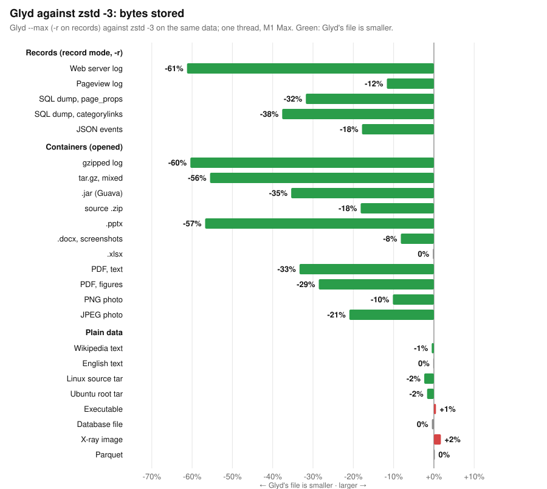

<h1 align="center">Glyd</h1>
<p align="center"><strong>Glyd - Fast lossless compression algorithm</strong></p>

<p align="center">
<a href="https://github.com/surya-koritala/Glyd/actions"></a>
<a href="LICENSE"></a>
<a href="glyd-store/LICENSE"></a>


<a href="include/glyd.h"></a>
<a href="https://github.com/surya-koritala/Glyd/releases"></a>
</p>

<p align="center">
<a href="#at-a-glance">At a glance</a> ·
<a href="#what-glyd-saves-you">Savings</a> ·
<a href="#quick-start">Quick start</a> ·
<a href="#levels-and-modes">Levels and modes</a> ·
<a href="#base-mode-a-version-compressed-against-the-last-one">Base mode</a> ·
<a href="#record-mode-logs-and-table-dumps-as-columns">Record mode</a> ·
<a href="#real-data-real-machines">Real data</a> ·
<a href="#known-gaps">Known gaps</a> ·
<a href="ROADMAP.md">Roadmap</a> ·
<a href="#license">License</a>
</p>

---

## At a glance

**Glyd** is a lossless compression library and CLI, written in Rust with a
C ABI, for the workloads where storage and read CPU decide the bill:
object storage, data lakes, logs and telemetry, backups and versioned
exports, RPC payloads, caches. It is a drop-in alternative to **LZ4**,
**Snappy** and **zstd**, and it does two things they do not: it turns
record-shaped data (logs, dumps, CSV, JSON lines) into typed columns
before compressing (`-r`), and it compresses a new version of an object
against the old one (`--base`).

Every number in this README is measured on public data, every decode
compared byte for byte with its input, against the reference codec on the
same machine and thread count in the same run. The full program and its
results: [docs/benchmarks/suite-2026-09-21.md](docs/benchmarks/suite-2026-09-21.md).

**The table everyone uses** — the 8.7 GB real-data corpus (logs, JSON
events, SQL dumps, Parquet) on AWS Graviton3, ratio · compress MB/s ·
decompress MB/s. One core, the way zstd's own README reports:

| Codec | Ratio | Compress MB/s | Decompress MB/s |
| :--- | ---: | ---: | ---: |
| LZ4 | 2.72 | **504** | 1,394 |
| ⚡&nbsp;**Glyd&nbsp;default** | 2.82 | 332 | **3,309** |
| zstd&nbsp;-3 | 3.86 | 313 | 1,425 |
| ⚡&nbsp;**Glyd&nbsp;‑‑max** | **3.98** | 233 | **1,571** |

Eight cores, what a server does (Glyd's output decodes in parallel; a
zstd or LZ4 frame decodes on one thread):

| Codec | Ratio | Compress MB/s | Decompress MB/s |
| :--- | ---: | ---: | ---: |
| ⚡&nbsp;**Glyd&nbsp;default** | 2.82 | **2,143** | **22,707** |
| zstd&nbsp;-3&nbsp;-T8 | 3.85 | 1,969 | 1,422 |
| ⚡&nbsp;**Glyd&nbsp;‑‑max** | 3.94 | 1,512 | **10,413** |
| ⚡&nbsp;**Glyd&nbsp;‑‑max&nbsp;‑r** | 4.71 | 643 | **4,040** |
| LZ4 | 2.72 | 503 | 1,392 |
| zstd&nbsp;-19&nbsp;-T8 | 4.66 | 13 | 1,326 |
| ⚡&nbsp;**Glyd&nbsp;‑‑ultra** | 4.66 | 14.5 | **9,620** |
| ⚡&nbsp;**Glyd&nbsp;‑‑ultra&nbsp;‑r** | **5.22** | 20 | **3,927** |

In one line: Glyd reads 3–7× faster than zstd on a server and stores 10–70%
less where the data has structure; it writes at 0.77× zstd -3's speed
(record mode 0.33×). For data written once and read many times that is the
right side of the trade; for data written constantly and rarely read,
zstd -3 or LZ4 still win on write cost.

- 🏪 **The store (`glyd-store`)**: `put` an object and it is kept as a delta against the stored object it most resembles, found by fingerprints, when that pays; chains capped at four. A 39 GB bucket (six Ubuntu image builds, fifteen kernel releases, two months of Wikipedia tables, twelve hours of GitHub events) stores in 1,334 MB against zstd -3's 6,132 MB: **4.6× fewer bytes**, put at 500 MB/s end to end, every object read back byte-exact.
- 🗂️ **Record mode (`-r`)**: logs, SQL dumps, CSV and JSON lines as typed columns; logs of varying shape as templates plus typed variables. Telemetry stores 2.5–3.5× less than zstd -3 and 1.5–2× less than zstd -19; application and system logs 1.4–3.3× less than zstd -3 and 1.1–2.1× less than zstd -19; the whole corpus 19% less than zstd -3.
- 📦 **Packs (`--pack`)**: many small objects as one record-mode stream with an index; 2–4× fewer bytes than zstd + dictionary per object, any one object read back in a millisecond.
- 🧩 **Shape dictionaries (`--shape`)**: record mode for a single small object. Trained on a sample; a 1–4 KB event or log object stores 1.1–1.9× less than with a zstd dictionary.
- 🧊 **Cold level (`--cold`)**: context mixing for what is stored for years and read rarely. 1.5–2.6× fewer bytes than zstd -19 on logs, dumps, JSON and text — the zpaq -m5 class at 3–4× its speed — at 1.2–1.5 MB/s per core each way.
- 🔁 **Base mode (`--base`)**: a new version against the old one, its content found wherever it moved. Dumps, images and source trees at 1–5% of their plain size; 1.1–2.1× less than `zstd --patch-from` at the fast tier, at 1.8–3× its speed; 15 kernel releases in 228 MB instead of 3 GB.
- 🔭 **128 MB long-distance matcher** (`--max --long`, `--ultra`, the store): JSON events 22% smaller than zstd -3, 10% smaller than zstd -19.
- 🚀 **Fastest reads at every ratio**: 8-way interleaved entropy coding and copy-only loops, units that decode one per core.
- 🛡️ **Verified**: 98 tests, a million-mutation fuzz per run, every earlier format decoded unchanged, the CLI round-tripped with corrupted copies on both AWS machines.
- 🔌 **Rust, C ABI, CLI**, streaming `std::io` adapters, trained dictionaries for small objects.

---

## What Glyd saves you

> **Try it:** [surya-koritala.github.io/Glyd/savings.html](https://surya-koritala.github.io/Glyd/savings.html) — enter what you store and what you compress with today.

Bytes stored, against zstd on the same data (measured; the sign is what
matters):

| Data | vs zstd -3 (the fast tier) | vs zstd -19 (the slow tier) |
| :--- | ---: | ---: |
| **A bucket of versioned objects** — images, releases, dumps, events (`--store`) | **−78%** (2.0–13.9× by family; events, with nothing to share, −23%) | |
| **Versions** of a dump, image or source tree (`--base`) | **−45 to −53%** vs zstd's fast patch; **−95 to −99%** vs the version alone | −5 to −21% (`--ultra`) |
| **Telemetry, measurements** as CSV or JSON lines (`-r`) | **−60 to −71%** | **−33 to −52%** |
| **Application and system logs** (HDFS, Spark, BGL, Android; `-r`) | **−28 to −69%** | **−9 to −53%** |
| **Cold archives** of logs, dumps, JSON, text (`--cold`, 1 MB/s per core) | **−52 to −69%** | **−32 to −62%** |
| **Small objects** (events, log and CSV objects of 1–4 KB) packed (`--pack`) | **−48 to −75%** vs zstd + dictionary per object | |
| **Access logs** (`-r`) | **−55%** | **−35%** |
| **SQL dumps** (`-r`) | **−41%** | **−30%** |
| **JSON events** (API payloads with hashes) | **−22%** | −10% |
| Whole mixed corpus (`-r`) | **−19%** | −10% |
| Plain text, binaries, Parquet | ~0% | ~0% (the floor; nothing moves it) |

A terabyte kept a year in S3 Standard, compressed once and read once a
month (Graviton3, CPU billed at the on-demand price): `--max -r` **$61.7**
against zstd -3's $73.3 and zstd -19's $102; at ten reads a month
`--max` **$81.3**, `--max -r` $82.4, zstd -3 $84.1; at a hundred reads a
month `--max` **$178** against zstd -3's $191 (its reads now cost less
CPU than zstd's), while `--max -r` is $289: record-mode reads spend 2×
the CPU rebuilding the columns
([report](docs/benchmarks/suite-2026-09-21.md)). At the scale of
object storage (hundreds of exabytes) every 1% fewer bytes is about $250
million a year at list price; the percentages above are what to multiply.

---

## Quick start

```bash
brew install surya-koritala/glyd/glyd        # macOS / Linux: the glyd and glyd-store CLIs, glyd.h
cargo install glyd glyd-store                # from crates.io
pip install https://github.com/surya-koritala/Glyd/releases/latest/download/glyd-0.14.3-py3-none-macosx_11_0_arm64.whl   # or the manylinux x86_64 / aarch64 wheel
```

Every [release](https://github.com/surya-koritala/Glyd/releases) carries
the CLIs, the shared and static libraries and `glyd.h` for Linux
x86_64, Linux aarch64 and macOS arm64, plus a Python wheel for each.
Bindings: [Python](bindings/python/README.md), [Go](bindings/go/glyd.go)
(cgo over `include/glyd.h`), C (`include/glyd.h`). Formats:
[docs/spec.md](docs/spec.md). lzbench: `contrib/lzbench/setup.sh <checkout>`.

```bash
cargo install --git https://github.com/surya-koritala/Glyd
```

```bash
glyd --max  events.json -o events.glyd            # the zstd -3 slot: fewer bytes, 3-7x faster reads
glyd --max -r access.log -o access.glyd           # record mode: logs, dumps, CSV, JSON lines as columns
glyd --ultra -r dump.sql -o dump.glyd             # fewest bytes from a parse; slow to write
glyd --cold -r dump.sql -o dump.glyd              # fewest bytes of all; 1 MB/s per core each way
glyd-store bucket/ --put mon.tar tue.tar wed.tar  # the store finds each object's base itself (glyd-store crate)
glyd-store bucket/ --get 2 -o wed.tar            # also --find NAME, --delete ID, --rebase ID, --compact, --verify, --stats
glyd-store meta/ --s3 s3://bucket/prefix --put wed.tar     # objects in S3 (or any S3-compatible service)
glyd-store --audit s3://bucket/prefix            # what the store would save there, from a sample, in dollars
glyd --base dump-mon.sql dump-tue.sql -o tue.glyd # base mode: Tuesday's dump against Monday's
glyd -d --base dump-mon.sql tue.glyd -o tue.sql   # decoding a base-mode file needs the base
glyd    telemetry.bin -o telemetry.glyd           # default: LZ4-class ratio, 22 GB/s reads on 8 cores
glyd -d events.glyd -o events.json                # the level and mode are in the stream
glyd -b bigfile                                   # benchmark every level on your data
```

Rust:

```rust
let mut out = Vec::new();
glyd::compress_parallel_into_max(&input, &mut out);   // or compress_into_max, _ultra, _cold, compress_into (default)
let back = glyd::decompress_parallel(&out)?;          // any level, any block mix

glyd::compress_records_into_max(&log, &mut out);      // record mode (-r); decompress() reads it
glyd::compress_with_base(&old, &new, &mut out, false);// base mode; decompress_with_base(&old, &out)
let mut store = glyd_store::Store::open("bucket/")?;   // the glyd-store crate: put finds the base, get rebuilds
let id = store.put("wed.tar", &data)?;  let back = store.get(id)?;
```

```python
import glyd                                   # bindings/python
c = glyd.compress(data, records=True)         # decompress(c); pack(objects); Store("bucket/").put(name, data)
glyd::decompress_stream(&out, |batch| file.write_all(batch))?;   // batches of units, bounded memory

// Dictionaries for small objects: train once on samples, keep the bytes.
let dict = glyd::Dict::train(&samples, 110 * 1024);
glyd::compress_with_dict(&dict, &doc, &mut out);      // or compress_with_dict_ultra
let back = glyd::decompress_with_dict(&dict, &out)?;
```

C / C++ / Go / Python (ctypes): link `libglyd` and include [`include/glyd.h`](include/glyd.h):

```c
size_t cap = glyd_max_compressed_len(n);
int64_t clen = glyd_compress_max_parallel(src, n, dst, cap);   // or glyd_compress / _parallel
int64_t dlen = glyd_decompress_parallel(dst, clen, out, n);
```

---

## Levels and modes

| Level | Use it for | How it works |
| :--- | :--- | :--- |
| **‑‑turbo**&nbsp;(‑t) | Data read far more often than written: caches, assets, KV-cache paging | v6 format, minimum match 10: fewest tokens, one 32-byte copy per token |
| **default** | The LZ4/Snappy slot with a better ratio and faster reads | v6 format, LZAV-class finder, minimum match 7 |
| **‑‑fast**&nbsp;(‑1) | LZ4-class compression speed | v6 format, LZ4-class finder, minimum match 5 |
| **‑‑max**&nbsp;(‑9) | The zstd -3 slot: fewer bytes, 3–7× faster reads on a server | v9 format: 8-way interleaved Huffman literals, tANS sequences with repeat offsets, a double-fast parse over an 8 MB window (zstd -3's, one rule stricter) |
| **‑‑max&nbsp;‑‑long**&nbsp;(‑L) | Events, logs, anything that repeats itself across an input | The same, with a 128 MB long-distance matcher run once before the parse (as `zstd --long`): 3–29% fewer bytes on events and logs, at a third more write time |
| **‑‑max&nbsp;‑‑dense**&nbsp;(‑D) | Objects written once and read rarely (the store's) | `--long`, in 128 MB units parsed in stripes on all cores: one core's bytes at any core count, 5–9% fewer on files of a few hundred MB; reads scale only with the units |
| **‑‑ultra**&nbsp;(‑19) | Write once, read many: datasets, release assets | v9 format on an optimal parse: binary-tree finder, every position priced in the coder's own bits ([design](docs/design/ultra-parse.md)) |
| **‑‑cold**&nbsp;(‑C) | Stored for years, read rarely: archives, compliance holds, the last copy | Context mixing: every bit predicted from eleven contexts (byte orders, the word, the column, the JSON key, the longest earlier match) with bit histories, mixed by two small networks, coded arithmetically; 32 MB units in parallel, 1–1.3 MB/s per core each way ([design](docs/design/format-v7.md#the-cold-level-context-mixing)) |

| Mode | Use it for | How it works |
| :--- | :--- | :--- |
| **‑r** record mode | Logs of any shape, SQL dumps, CSV/TSV, JSON lines | Detects the shape (delimited lines, dumps, JSON lines, or templates for logs of varying shape), turns each field, key path or template slot into a typed stream (integer, decimal and date-time deltas, dictionaries with recency ranks, text), compresses those with the level in 32 MB units, rebuilds exactly ([design](docs/design/format-v7.md#record-mode-v040-typed-columns-before-the-level)) |
| **‑‑base** base mode | Versions: nightly dumps, snapshots, images, source trees | Parses each 32 MB of the new version with the region of the old one that holds its content (found through a coarse map of the base) as history; the stream decodes with the same base ([design](docs/design/format-v7.md#base-mode-v050-a-version-compressed-against-the-last-one)) |

All levels write one container; the decoder reads any mix. Blocks are
256 KB; the parallel paths cut the input into units (one per core, up to
128 MB) that compress and decode independently. The CLI decodes a batch of
units at a time into one reused buffer, so its memory is a batch, not the
file.

---

## Real data, real machines

The verification and benchmark program: 8.7 GB of logs, JSON events,
SQL dumps and Parquet; zstd -3, zstd -19 and LZ4 on the same AWS machines
(Graviton3 c7g.2xlarge and Sapphire Rapids c7i.2xlarge) and thread counts;
small objects with dictionaries trained on other days' data; a real S3
round trip (compress, upload, download, decompress, sha256) costed at list
prices. Method: [docs/benchmarks/README.md](docs/benchmarks/README.md);
results with every table: [docs/benchmarks/suite-2026-09-21.md](docs/benchmarks/suite-2026-09-21.md);
raw rows: [benchmarks/suite/](benchmarks/suite/).

The short version: `--max` stores 2.2% less than zstd -3 over the corpus
(24% less on JSON events), decodes 3–7× faster with 8 cores and 1.10×
(Graviton3) / 0.85× (Sapphire Rapids) on one core, and compresses at
0.71–0.77× zstd -3's speed. `--ultra` equals zstd -19 (10% smaller on
JSON). `--max -r` stores 18% less than zstd -3 and 1% less than zstd -19
at 500–645 MB/s on 8 cores; `--ultra -r` 11% less than zstd -19.

## Against zstd, xz and brotli on 24 kinds of data

Every codec's own CLI on one thread, every decode compared byte for
byte with its input. Green: Glyd's file is smaller.



| Data | vs zstd -3 (`--max`) | vs zstd -19, xz, brotli -11 (`--ultra`) |
| :--- | :--- | :--- |
| Records: logs, dumps, JSON (`-r`) | **12–61% fewer bytes** | **3–38% fewer** (JSON: 9% more) |
| Containers: gzip, zip, Office, PDF, PNG, JPEG | **up to 60% fewer** | **14–63% fewer** |

Glyd wins where the data has structure: each field of a record becomes
a column, and the deflate or JPEG inside a container is opened and
re-created bit for bit. On plain text, executables and Parquet it is
zstd-class: within 2% at the fast tier, 1–15% larger than xz and
brotli -11 at their strongest. Every codec's speed, the strong-tier
and ratio-against-speed charts, and lz4, bzip2, zpaq and JPEG XL:
[docs/benchmarks/landscape-2026-09-22.md](docs/benchmarks/landscape-2026-09-22.md).

## The store: compression across objects

Inside one object every codec sits on the same floor: on plain bytes
zstd -19, xz and Glyd `--ultra` land within 5% of each other, and the
levers that beat it (columns, base mode, context mixing) each take a
kind of data. The redundancy of object storage is elsewhere — between
objects. A bucket holds builds, snapshots, dumps and releases that are
near-copies of earlier ones, and a codec that sees one object at a time
cannot know it.

The store is its own crate, `glyd-store` (`glyd-store DIR --put ...`;
under the Business Source License, the codec being BSD-3-Clause OR GPL-2.0).
`Store::put` fingerprints the object (one sparse anchor in 4 KB, the
same map base mode uses), looks the fingerprints up in the store's
table, takes the stored object sharing the most as the base, and keeps
the object as a delta against it (`--base`) when that saves a fifth or
more of what it costs alone; else alone at `--max` (record mode where
it pays; `--ultra` or `--cold` on request). Chains are at most four
long (past that the chain's root is the base), so a read is at most
five decodes at 6–10 GB/s; `rebase(id)` stores an object read often
alone again. `get`, `id_of(name)`, `delete` (a deleted object's bytes
stay while a live chain runs through them), `compact` (frees what no
live object needs), `verify` (every object read back and checked).
The objects' bytes go through a `Backend`: a directory, or an S3
bucket over HTTPS (`--s3 s3://bucket/prefix`, or any S3-compatible
service through `AWS_ENDPOINT_URL`). Metadata stays local, but every
object's index lines ride beside it in the backend, so `--rebuild`
remakes a lost metadata directory from the objects alone. When two stored objects score
within 2× of each other as bases, both are tried on the first 32 MB. Measured on a realistic bucket
(`scripts/download_bucket.sh`, 39 objects, 39.2 GB, each arriving in
order), every object read back and compared:

| Family | Raw | zstd -3, each object alone | ⚡&nbsp;**Glyd store** | **Gain** |
| :--- | ---: | ---: | ---: | ---: |
| Linux 6.10 releases (15) | 22.5 GB | 3,237 MB | **232 MB** | **13.9× smaller** |
| Ubuntu 24.04 cloud images (6 builds) | 6.6 GB | 1,880 MB | **361 MB** | **5.2×** |
| Wikipedia dumps (2 months, 3 tables) | 0.7 GB | 140 MB | **71 MB** | **2.0×** |
| GitHub events (12 hours) | 9.4 GB | 875 MB | 670 MB | 1.3× (no object is a version of another) |
| **The bucket** | **39.2 GB** | **6,132 MB (6.4×)** | **1,334 MB (29.4×)** | **4.6× smaller** |

At a terabyte ([report](docs/benchmarks/store-gate-2026-09-22.md)):
1,192 objects, 1.18 TB — 400 kernel point releases, every hour of
GitHub events in January 2024, five English Wikipedia dumps' tables,
six Ubuntu images — put through the store into S3 from one 16-vCPU
instance next to the bucket, every object read back and compared
byte for byte, the metadata directory deleted and rebuilt from the
bucket, then verified: **49.0 GB stored against zstd -3's 153.5 GB,
3.13× fewer bytes (24× against raw)**; kernels 115–285× against raw,
Wikipedia tables 21×, hourly events 12.9× (record mode alone). Put ran
at 243 MB/s (150 before the put's time was cut) and read-back at
166–186 MB/s, S3 included, on that instance.

Put runs at 620 MB/s end to end over the bucket on ten cores (reading
the file, rebuilding the base, writing the delta; a version of the
last object put runs at 900 MB/s, that object being kept in memory as
the likeliest next base); verifying the whole bucket reads it back at
1.5 GB/s. The same store built on zstd's own
`--patch-from` would land around 3–4×: our deltas are 1.1–2.1× smaller
and read 10× faster, and the store design does the rest. In money, a
petabyte of such data in S3 Standard costs $43K a year with zstd -3
and $9.4K with the store. Chunk-level dedup, what backup systems do, gains
1–4× on the same pairs. The store is a directory: `objects/<id>`, the
fingerprints, an index, and the fingerprint table — an open-addressing
hash table mapped from disk (12 bytes per 4 KB stored, kept at most
half full), so the store's memory does not grow with what it holds;
the 39 GB bucket's table is 100 MB. Objects under 256 KB have nothing
to fingerprint and would cost their whole size alone, so `put` gathers
them into 2 MB packs (record mode where it pays) and `get` decodes the
pack and slices: 2,000 GitHub events put one by one store at 9.0×
against zstd -3's 3.6× per event.

## Base mode: a version compressed against the last one

Most stored bytes are versions: nightly dumps, snapshots, images,
source trees, artifacts rebuilt with small changes. A new version
compressed alone costs what the first did; compressed against the old
one it costs the change. `glyd --base old new` parses every 32 MB of
the new version with the region of the old one that holds its content
as history (the long-distance matcher reaches all of it) and writes a stream that
decodes with the same base: `glyd -d --base old new.glyd`. Measured on
consecutive versions of real objects against zstd 1.5.7's
`--patch-from`, the same machine and thread count, every rebuild
byte-exact (`scripts/bench_versions.sh`, data from
`scripts/download_versions.sh`):

| Old → new | zstd -3 --patch-from | zstd -19 --patch-from | ⚡&nbsp;**Glyd&nbsp;‑‑max&nbsp;‑‑base** | **Glyd&nbsp;‑‑ultra&nbsp;‑‑base** |
| :--- | ---: | ---: | ---: | ---: |
| Wikipedia `page` dumps a month apart (108 MB) | 3.84 MB · 409 MB/s | 1.30 MB · 2 MB/s | **1.79 MB · 720 MB/s** | **1.23 MB** · 6 MB/s |
| Ubuntu 24.04 cloud root filesystem, builds 16 days apart (1.1 GB) | 8.82 MB · 654 MB/s | 5.61 MB · 39 MB/s | **5.33 MB · 1,590 MB/s** | **4.60 MB** · 11 MB/s |
| Linux 6.10 → 6.10.1 source tar (1.5 GB) | 3.26 MB · 560 MB/s | 2.58 MB · 30 MB/s | **3.03 MB · 1,700 MB/s** | **2.04 MB** · 3 MB/s |

Compressed alone with `--max` those versions are 33, 287 and 200 MB.
`--max --base` stores 1.1–2.1× less than zstd's fast patch at 1.8–3×
its speed, and on the image pair less than zstd's slow patch at 40×
its speed; `--ultra --base` stores 5–21% less than zstd -19's patch on
every pair at the plain `--ultra` speed, which is 3–10× slower than
zstd -19's patch on the large pairs. Reads run at 6–10 GB/s. Content
is found wherever it moved: each unit's region of the base is chosen
from a coarse map of the base (one anchor per KB), so a version with
48 MB inserted before the kernel tree still costs 18.4 MB (zstd -3
--patch-from 18.7; a fixed window around the unit's own position,
33.5). Chunk-level dedup, the backup approach, gains 1–4× on the same
pairs ([experiments/structure/README.md](experiments/structure/README.md)).

Over a chain of versions, the Linux 6.10 point releases (15 versions
of a 1.5 GB tree; `scripts/download_chain.sh`, `scripts/bench_chain.sh`),
each version against the one before it, or against 6.10 alone so that
any version is two reads:

| Stored | Glyd --max --base | zstd -3 --patch-from | Stored one by one |
| :--- | ---: | ---: | ---: |
| 6.10 plus 14 point releases, each against the previous | **228 MB** | 260 MB | Glyd --max 3,000 MB · zstd -3 3,236 MB |
| the same, each against 6.10 | **246 MB** | 265 MB | |

A step costs 1.8 MB (0.12% of the tree; 3.0–3.1 MB when the release
number grows a digit, which touches every path in the archive) and
the delta against a base 14 versions old costs 3.6 MB, so rebasing
inside a release series is not needed. A terabyte of such trees in
S3 Standard ($276 per stored TB-year) costs $37 a year compressed one
by one with `--max` ($40 with zstd -3) and $2.8–3.0 with base mode
($3.2–3.3 with zstd's patch).

## Record mode: logs and table dumps as columns

Byte-level matching is a plateau: on real data zstd -19, xz and Glyd
`--ultra` land within a few percent of each other. The redundancy of a
log or a table dump is not in nearby bytes but in the same field of
every record. `glyd -r` (record mode, [design](docs/design/format-v7.md#record-mode-v040-typed-columns-before-the-level))
detects delimited lines, SQL dumps and JSON lines, turns them into one
typed stream per field or key path (integer, decimal and date-time
deltas, dictionaries with recency ranks, text), compresses those with
the chosen level in parallel 32 MB units, and rebuilds the bytes
exactly. Anything else is left as it is.

The 8.7 GB benchmark corpus, 10 cores, every decode byte-checked
(`examples/bench_suite.rs`, rows in [`benchmarks/suite/m1-max-v0.4.0/`](benchmarks/suite/m1-max-v0.4.0/)):

| Data | Glyd&nbsp;‑‑max | Glyd&nbsp;‑‑ultra | ⚡&nbsp;**Glyd&nbsp;‑‑max&nbsp;‑r** | ⚡&nbsp;**Glyd&nbsp;‑‑ultra&nbsp;‑r** | zstd&nbsp;-3 | zstd&nbsp;-19 | **‑‑ultra&nbsp;‑r vs zstd&nbsp;-19** |
| :--- | ---: | ---: | ---: | ---: | ---: | ---: | ---: |
| SQL dumps (3.9 GB) | 4.96 | 6.98 | **8.38** | **10.14** | 4.97 | 7.10 | **1.43× smaller** |
| Access logs (0.55 GB) | 10.56 | 14.40 | **21.4** | **23.0** | 9.53 | 14.9 | **1.54× smaller** |
| Pageview logs (0.71 GB) | 3.71 | 4.68 | **4.10** | **4.92** | 3.56 | 4.82 | 1.02× |
| JSON events (2.6 GB) | **13.26** | **16.40** | 13.26 | 16.40 | 10.46 | 15.07 | **1.09× smaller** |
| Parquet (1.0 GB) | 1.01 | 1.02 | 1.01 | 1.02 | 1.01 | 1.02 | 1.00× |
| Whole corpus | 3.94 | 4.66 | **4.71** | **5.22** | 3.85 | 4.66 | **1.12× smaller** |

`--max -r` is 1% smaller than zstd -19 over the corpus while
compressing at 640 MB/s against 13 (8 Graviton3 cores); `--ultra -r` is
12% smaller than zstd -19, and plain `--ultra` equals it. JSON events
are not record-shaped (their redundancy is inside each record and
across the whole file), so `-r` hands them to the plain level, where
the long-distance matcher (repeats up to 128 MB back, on at `--max
--long` and `--ultra`) does the work: 13.26 and 16.40 against 11.49 and 14.59
with the 8 MB window, 27% and 9% smaller than zstd -3 and zstd -19.
Costs: `--max` compresses the corpus at 2,000 MB/s (2,400 without the
matcher; zstd -3 4,000), record-mode reads run at 4,400 MB/s instead
of 6,500-8,700 for plain `--max`.

Telemetry is where the multiples are. Measurements as rows (a cluster
trace, daily weather, taxi trips) in CSV or as JSON lines
(`scripts/download_ext_corpus.sh`, 128 MB slices, 10 cores, rows in
[`benchmarks/suite/m1-max-v0.4.0/bench_suite_ext2.txt`](benchmarks/suite/m1-max-v0.4.0/bench_suite_ext2.txt)):

| Data | ⚡&nbsp;**Glyd&nbsp;‑‑max&nbsp;‑r** | ⚡&nbsp;**Glyd&nbsp;‑‑ultra&nbsp;‑r** | zstd&nbsp;-3 | zstd&nbsp;-19 | **‑‑max&nbsp;‑r vs zstd&nbsp;-3** | **‑‑ultra&nbsp;‑r vs zstd&nbsp;-19** |
| :--- | ---: | ---: | ---: | ---: | ---: | ---: |
| Alibaba cluster machine usage, CSV | **12.6** | **13.7** | 4.46 | 6.90 | **2.8× smaller** | **2.0× smaller** |
| the same as JSON lines | **54.6** | **58.9** | 15.7 | 28.7 | **3.5× smaller** | **2.1× smaller** |
| NOAA daily weather, CSV | **19.6** | **23.1** | 6.99 | 12.0 | **2.8× smaller** | **1.9× smaller** |
| the same as JSON lines | **47.0** | **58.0** | 18.7 | 31.6 | **2.5× smaller** | **1.8× smaller** |
| NYC taxi trips, CSV export | **8.93** | **9.37** | 5.64 | 8.38 | **1.6× smaller** | 1.1× smaller |
| Common Crawl index (a hash per line) | 7.73 | 9.36 | 7.55 | 9.66 | 1.02× | 0.97× |

`--max -r` compresses these at 340-680 MB/s (10 cores) and reads back
at 770-2,500 MB/s. The last row is the honest limit: a line that is
mostly a hash has nothing a column can model, and API events with
hashes and free text (GitHub Archive) gain 1.6% from columns and stay
plain.

Logs whose lines vary in shape (application and system logs) take the
template shape: each line's template — its text with a hole where every
token holding a digit was — goes into a dictionary, and the tokens
become typed columns keyed by template and slot (loghub 2.0 logs, 128 MB
of each, 10 cores, every decode byte-checked):

| Log | zstd&nbsp;-3 | zstd&nbsp;-19 | ⚡&nbsp;**Glyd&nbsp;‑‑max&nbsp;‑r** | ⚡&nbsp;**Glyd&nbsp;‑‑ultra&nbsp;‑r** | **‑‑max&nbsp;‑r vs zstd&nbsp;-3** | **‑‑ultra&nbsp;‑r vs zstd&nbsp;-19** |
| :--- | ---: | ---: | ---: | ---: | ---: | ---: |
| HDFS (Hadoop file system) | 10.5 | 16.0 | **22.0** | **27.5** | **2.1× smaller** | **1.72× smaller** |
| Spark (application logs) | 14.5 | 25.2 | **47.0** | **53.6** | **3.3× smaller** | **2.12× smaller** |
| BGL (supercomputer RAS log) | 11.0 | 22.4 | **15.9** | **28.9** | **1.45× smaller** | **1.29× smaller** |
| Android (system log) | 12.9 | 23.0 | **17.9** | **25.4** | **1.39× smaller** | **1.10× smaller** |

`--max -r` writes these at 260-460 MB/s and reads them back at
1,200-1,400 MB/s.

### Objects opened: gzip, zip, tar, Office documents, jars, PDF, PNG — and JPEG transcoded

Much of what sits in a bucket is deflate inside a container — gzipped
logs (ELB, CloudFront, CloudTrail and flow logs are delivered that
way), zip and tar archives, .docx/.xlsx/.pptx, .jar, PDF, PNG — and
to zstd all of it is noise. Containers inside containers open too,
four deep: a tar of gzipped logs, a tar.gz of pictures, a deck's
JPEGs under their deflate entries. Glyd opens the container: every
deflate stream inside is decoded to its content along with what it
takes to re-encode it bit for bit (Glyd's own reconstruction since
v0.13.4, `src/reflate/`: zlib's matcher run over the content, only
what differs kept); the plain text is that
content, then every other byte of the object as it was (headers,
directories, stored entries, a tar's files) and the corrections, and
it takes the level asked for — record mode where it pays, the cold
level, a base, which sees all of it, so versions of an archive share
what they have in common. Containers open from `--max` up; the
default, fast and turbo levels leave them as they are, since a read of
an opened container re-creates its deflate. `-d` gives back the
identical object; `-d --content` gives what `gunzip` would — a gzip's
members' text, a tar.gz's tar — without re-creating the stream, which
is the expensive part of the read (the 20.7 MB NASA gzip on one
thread: 0.36 s for the content against 1.58 s for the gzip back; on
ten cores 0.11 s; `gunzip` itself 0.10 s). The store has it as
`--get ID --content`. The
object is also compressed closed, at the same level, and the smaller
of the two is kept. Measured on this Mac, every decode compared with
the input:

| Object | As is | zstd -19 on it | ⚡&nbsp;**Glyd ‑‑max** | ⚡&nbsp;**‑‑ultra** | ⚡&nbsp;**‑‑cold** |
| :--- | ---: | ---: | ---: | ---: | ---: |
| NASA access log, gzip -6 (205 MB inside) | 20.7 MB | 20.7 MB | **8.19 MB (−60%)** | 7.67 MB | **6.55 MB (−68%)** |
| Linux tree, 512 MB, gzip -6 | 72.7 MB | 72.0 MB | **56.1 MB (−23%)** | 42.0 MB | **28.6 MB (−61%)** |
| zstd source, GitHub zip | 2.73 MB | 2.57 MB | **2.14 MB (−22%)** | 1.66 MB | **1.34 MB (−51%)** |
| Guava jar, 2,059 entries | 3.05 MB | 2.70 MB | **1.77 MB (−42%)** | 1.42 MB | **1.11 MB (−64%)** |
| .pptx, 60 slides | 88 KB | 56 KB | **24.7 KB (−72%)** | 21.5 KB | **15.2 KB (−83%)** |
| .pptx, 12 slides of photos (6.5 MB) | 6.51 MB | 6.50 MB | **5.26 MB (−19%)** | 5.16 MB | **5.07 MB (−22%)** |
| .docx, 6 PNG screenshots (2.5 MB) | 2.51 MB | 2.50 MB | **2.32 MB (−8%)** | 2.08 MB | **1.65 MB (−34%)** |
| tar of the 6 photos, and the same tar gzipped | 36.0 MB | 35.5 MB | **27.3 MB (−24%)**, −23% through the gzip | | |
| tar.gz of a gzipped log, a PDF, a PNG, a .docx (23 MB) | 22.9 MB | 22.9 MB | **10.2 MB (−56%)** | 9.47 MB | **7.94 MB (−65%)** |
| .xlsx, 30,000 rows | 1.34 MB | 1.23 MB | 1.33 MB (kept closed) | 1.05 MB | **0.47 MB (−65%)** |
| .docx, 400 sections | 141 KB | 138 KB | 140 KB | 117 KB | **76.7 KB (−46%)** |
| RFC 8878, PDF | 440 KB | 242 KB | **191 KB (−57%)** | 158 KB | **106 KB (−76%)** |
| arXiv paper, PDF (pdfTeX) | 2.22 MB | 1.04 MB | **741 KB (−67%)** | 616 KB | **504 KB (−77%)** |
| arXiv paper with figures, PDF | 6.77 MB | 5.54 MB | **4.24 MB (−37%)** | 3.55 MB | **2.82 MB (−58%)** |
| PNG photo | 1.83 MB | 1.77 MB | **1.65 MB (−10%)** | 1.52 MB | **1.19 MB (−35%)** |
| PNG illustration | 669 KB | 663 KB | **634 KB (−5%)** | 540 KB | **448 KB (−33%)** |
| 6 JPEG photos, 35.9 MB | 35.9 MB | 35.9 MB | **27.3 MB (−24%)** at every level from `--max` up | | |

Where the container's own deflate was already near what the fast
level does on the content (an Office XML sheet), the fast level keeps
it closed and the slower levels open it. The cost is the re-encode
that makes it exact: about 5 MB/s of deflate per core in (50 MB/s of
content), three times that out — and a stream of 16 MB of content or
more is cut into chunks that open and close on every core, so on ten
cores the NASA gzip writes in 2.3 s and reads in 0.26 s (one core: 4.6
and 1.56), the PDF with figures in 1.9 and 0.59 s (13.7 and 4.3); per
terabyte of gzipped logs on S3 Standard, about $2 of CPU once against
$166 a year. GNU gzip's
streams open the same as macOS's (checked on Linux: an hour of events
gzipped, 75.3 → 33.2 MB; a Linux tree, 72.2 → 55.1 MB; byte-exact).
Streams preflate cannot reproduce, or predicts badly (corrections
over a quarter of the stream), are kept as they are: 18 of the jar's
2,059. JPEG takes
a different road: its DCT coefficients are taken out and coded by
Glyd's own model (v0.14.0, `src/jpg/`: each coefficient under the
blocks above and to the left, the first row and column predicted
from pixel continuity across the block edge, the DC from both
edges), 22–26% fewer bytes on five photos — smaller than Lepton on
every one — at 13–22 MB/s in and 25–46 out on this Mac's cores, the
identical JPEG back — inside a zip or an Office document too, stored
or deflated. Parquet (its columns as records,
26–40%, the same table rather than the same bytes) is measured in
[experiments/research](experiments/research/README.md#j-re-doing-what-is-already-compressed)
and not yet built.

### The cold level: context mixing for what is read rarely

Every LZ codec sits on the same floor: on the data above zstd -19, xz -9
and Glyd `--ultra` land within 5% of each other. Below that floor is
context mixing — each bit predicted from many contexts at once and coded
at the mixed probability, with no parse — at 30–100× the CPU. `glyd
--cold` is that level: eleven predictors (byte orders 1–4, 6 and 8, the
word and the word before it, the column and the byte above it, the JSON
key, the longest earlier match), paq-style bit histories, two mixers,
two SSE stages, 32 MB units coded in parallel. Measured on 64 MB slices
against the strongest tools, one thread each for the references, every
decode byte-checked (`experiments/research/coldtier.sh`):

| Data | zstd&nbsp;-19 | xz&nbsp;-9 | Glyd&nbsp;‑‑ultra&nbsp;(‑r) | zpaq&nbsp;-m5 | ⚡&nbsp;**Glyd&nbsp;‑‑cold&nbsp;(‑r)** | **vs zstd&nbsp;-19** |
| :--- | ---: | ---: | ---: | ---: | ---: | ---: |
| GitHub Archive JSON events | 14.6× | 14.8× | 15.9× | 22.8× · 0.4 MB/s | **22.5×** · 1.3 MB/s/core | **1.54× smaller** |
| NASA access log | 15.7× | 15.4× | 26.4× | 31.7× · 0.3 MB/s | **31.1×** · 1.2 MB/s/core | **1.98× smaller** |
| enwiki page_props SQL dump | 6.2× | 6.4× | 8.6× | 11.1× · 0.4 MB/s | **11.6×** · 1.2 MB/s/core | **1.87× smaller** |
| webster (text, 41 MB) | 4.8× | 4.9× | 4.8× | 7.3× · 0.35 MB/s | **7.1×** · 1.2 MB/s/core | **1.47× smaller** |
| HDFS log, 128 MB (`-r`) | 16.0× | | 27.5× | | **33.7×** | **2.1× smaller** |
| Spark log, 128 MB (`-r`) | 25.2× | | 53.6× | | **65.2×** | **2.6× smaller** |

`--cold` matches zpaq's strongest level within 3% either way at 3–4×
its speed per core, and reads back at the same speed it writes: a
terabyte costs about 210 core-hours each way, $8 on Graviton3. Against
that, 1.5–2× fewer bytes than zstd -19 saves $3–5 a year per raw
terabyte in S3 Standard-IA and under $0.50 in Glacier Deep Archive, so
the level pays for data kept two years or more in a warm-ish tier and
read a few times at most, and for bytes that are moved (egress,
replication) more than they are read. The encoder holds 400 MB per
thread.

### Small objects with a shape dictionary

A single event, a small log or CSV has nothing to learn a schema from,
so small objects got the plain path and its dictionaries. A **shape
dictionary** (`glyd --shape-train sample -o d.shape`, then `glyd
--shape d.shape object`) is trained once on a few MB of the data and
carries the shape, the frames lines take, the columns' types and the
values dictionary columns usually hold; an object is coded as a
compact image (a byte per row, values as ranks and deltas, new values
as text) through a prepared LZ dictionary trained on such images.
Objects cut from real files, the dictionaries trained on the first
4 MB of each, objects from the middle, every decode byte-checked
(`examples/shape_gain.rs`):

| Objects | zstd -3 + dict | Glyd --max + Dict | ⚡&nbsp;**Glyd shape dictionary** | **vs zstd + dict** |
| :--- | ---: | ---: | ---: | ---: |
| Alibaba machine usage, JSON lines, 4 KB | 13.0× | 13.1× | **24.3×** | **1.87× smaller** |
| the same, 1 KB | 10.6× | 10.3× | **14.6×** | **1.37×** |
| Alibaba machine usage, CSV, 4 KB | 4.4× | 4.2× | **7.9×** | **1.81×** |
| the same, 1 KB | 3.8× | 3.7× | **5.8×** | **1.53×** |
| NYC taxi CSV, 1 KB | 3.9× | 3.9× | **5.3×** | **1.35×** |
| HDFS log, 4 KB | 7.4× | 7.1× | **9.7×** | **1.31×** |
| the same, 1 KB | 6.0× | 5.6× | **6.7×** | **1.12×** |
| NASA access log, 4 KB | 6.4× | 6.9× | **7.3×** | **1.14×** |
| the same, 1 KB | 5.3× | 5.4× | 5.1× | 0.97× |

1.1–1.9× fewer bytes than a zstd dictionary on telemetry and structured
logs, nothing on an access log of 1 KB: its bytes are host names and
paths the object is the first to mention, and a per-object scheme pays
for new information whatever it does. Dictionaries are 80–220 KB; an
object codes at 60–150 MB/s and decodes at 55–430 MB/s on one core.

The larger lever for small objects is not per-object at all. A
**pack** (`compress_pack`, `decompress_pack_object`; `glyd --pack
files... -o p.glyd`, `glyd --unpack dir p.glyd`) compresses many small
objects as one record-mode stream with an index of their lengths, so
they cost what they cost as a file; reading one object is the pack
decoded and sliced. The same objects in 1 MB packs at `--max`:

| Objects | zstd -3 + dict, each alone | ⚡&nbsp;**Glyd pack** | **vs zstd + dict** | One object read |
| :--- | ---: | ---: | ---: | ---: |
| JSON events, 1 KB (1,024 per pack) | 10.6× | **42.4×** | **4.0× smaller** | 0.6 ms |
| JSON events, 4 KB | 13.0× | **39.0×** | **3.0×** | 0.9 ms |
| NASA access log, 1 KB | 5.3× | **15.2×** | **2.9×** | 0.7 ms |
| HDFS log, 1 KB | 6.0× | **16.2×** | **2.7×** | 0.5 ms |
| CSV telemetry, 1 KB | 3.8× | **8.9×** | **2.3×** | 0.9 ms |
| NYC taxi CSV, 1 KB | 3.9× | **7.6×** | **1.9×** | 1.0 ms |

Packing runs at 40–130 MB/s on one core. A store that groups small
objects — a log shipper, an event stream, an S3 batcher — gets 2–4×
over per-object dictionaries; one that must compress each object alone
gets the shape-dictionary table above.

### Small objects

Objects cut from GitHub Archive events, 2,000 per size, each codec with
its own 110 KB dictionary trained on 2,000 other objects (zstd's
trainer for zstd, `Dict::train` for Glyd; zstd's output carries no
checksum, Glyd's 4 bytes per object). Apple M1 Max, one core,
`examples/small_objects.rs` and `examples/small_speed.rs`:

| Object | zstd&nbsp;-3&nbsp;+&nbsp;dict | ⚡&nbsp;**Glyd&nbsp;‑‑max&nbsp;+&nbsp;Dict** | zstd&nbsp;-19&nbsp;+&nbsp;dict | ⚡&nbsp;**Glyd&nbsp;‑‑ultra&nbsp;+&nbsp;Dict** |
| ---: | ---: | ---: | ---: | ---: |
| 1 KB | 4.96 | **4.75** | 5.47 | **5.25** |
| 4 KB | 6.42 | **6.28** | 7.41 | **7.13** |
| 16 KB | 7.66 | **7.65** | 8.95 | **8.84** |

| Object | Codec | Compress | Decompress |
| ---: | :--- | ---: | ---: |
| 1 KB | ⚡&nbsp;**Glyd&nbsp;‑‑max&nbsp;+&nbsp;Dict** | 245&nbsp;MB/s | **920&nbsp;MB/s** |
| 1 KB | zstd -3 + dict | 454&nbsp;MB/s | 1,117&nbsp;MB/s |
| 4 KB | ⚡&nbsp;**Glyd&nbsp;‑‑max&nbsp;+&nbsp;Dict** | 321&nbsp;MB/s | **1,209&nbsp;MB/s** |
| 4 KB | zstd -3 + dict | 588&nbsp;MB/s | 1,440&nbsp;MB/s |
| 16 KB | ⚡&nbsp;**Glyd&nbsp;‑‑max&nbsp;+&nbsp;Dict** | 394&nbsp;MB/s | **1,674&nbsp;MB/s** |
| 16 KB | zstd -3 + dict | 635&nbsp;MB/s | 1,890&nbsp;MB/s |

On small objects zstd is ahead: 1-4% denser at `-3` and 1-4% at `-19`,
1.6-1.9× faster to compress and 1.1-1.2× faster to decode. Without a
dictionary Glyd `--max` is 6-12% less dense than zstd -3 on objects
under 16 KB.

On the AWS machines (dictionaries trained on another day's data, 110 KB):
sizes within 1–3% of zstd's either way, zstd 1.7–2× faster to compress and
1.4–1.7× faster to decompress per object. Without a dictionary a 1 KB log
record compresses 2.5×; with one, 5.2× (zstd: 2.9× and 5.3×).

### The classic corpus: Silesia, one run, one core (Apple M1 Max; v0.3.0 run)

| Codec | Ratio | Compress MB/s | **Decompress MB/s** | |
| :--- | ---: | ---: | ---: | :--- |
| ⚡&nbsp;**Glyd&nbsp;‑‑max** | **3.254** | 277 | **1,733** | ✅ best ratio; 1.27× zstd&nbsp;-3 decode |
| zstd&nbsp;-3 | 3.205 | 319 | 1,361 | |
| zstd&nbsp;-1 | 2.894 | 535 | 1,493 | |
| LZAV-hi | 2.803 | 91 | 3,185 | |
| LZAV | 2.450 | 426 | 3,128 | |
| zstd&nbsp;‑‑fast=1 | 2.438 | 614 | 2,153 | |
| zstd&nbsp;‑‑fast=3 | 2.240 | 684 | 2,307 | |
| ⚡&nbsp;**Glyd&nbsp;default** | **2.192** | 312 | **6,507** | ✅ 1.6× liblz4 decode, better ratio |
| ⚡&nbsp;**Glyd&nbsp;‑‑fast** | **2.176** | 501 | **4,670** | ✅ 1.1× liblz4 decode, better ratio |
| liblz4 | 2.101 | 610 | 4,108 | |
| lz4_flex | 2.097 | 633 | 3,004 | |
| snappy | 2.076 | 607 | 1,495 | |
| zstd&nbsp;‑‑fast=5 | 2.057 | 746 | 2,484 | |
| ⚡&nbsp;**Glyd&nbsp;‑‑turbo** | 1.884 | 263 | **8,647** | ✅ fastest decode, 2.1× liblz4 |

(`examples/field_survey.rs`, taken with other work on the machine, before
the 128 MB matcher; the ordering has not changed. This release on the
same machine and corpus: `--max` 3.302 at 244 MB/s and 1,856 MB/s
decode, `--ultra` 3.959 at 3.2 MB/s and 1,910 MB/s decode, against
zstd -3 3.205 / 335 / 1,453 and zstd -19 4.006 / 3.7 / 1,589 in the
same runs, `examples/v7_bench.rs` and `examples/ultra_bench.rs`.)

<details>
<summary><b>Default level vs liblz4, per file</b> (same run)</summary>

| File | Ratio | ⚡ **Glyd MB/s** | liblz4 MB/s | Glyd advantage |
| :--- | ---: | ---: | ---: | ---: |
| dickens | 1.815 | 5,990 | 5,190 | +15% |
| mozilla | 1.926 | 5,420 | 4,830 | +12% |
| mr | 1.902 | 6,650 | 5,570 | +19% |
| nci | 6.846 | 7,130 | 7,240 | −2% |
| ooffice | 1.335 | 6,310 | 4,680 | +35% |
| osdb | 2.294 | 6,270 | 5,110 | +23% |
| reymont | 2.378 | 5,040 | 4,490 | +12% |
| samba | 2.858 | 6,380 | 6,140 | +4% |
| sao | 1.038 | 13,710 | 7,320 | +87% |
| webster | 2.250 | 4,700 | 4,850 | −3% |
| xml | 4.949 | 6,420 | 5,560 | +16% |
| x-ray | 1.000 | 46,600 | 18,100 | +157% |

(AMD Ryzen 9 7950X3D, AVX2 path. On the M1 Max NEON path Glyd wins 12 of 12.)

</details>

<details>
<summary><b><code>--max</code> vs zstd -3, per file</b> (same run, M1 Max)</summary>

| File | ⚡ **Glyd ratio** | zstd -3 ratio | ⚡ **Glyd MB/s** | zstd -3 MB/s |
| :--- | ---: | ---: | ---: | ---: |
| dickens | 2.848 | 2.782 | 1,367 | 1,220 |
| mozilla | 2.801 | 2.810 | 1,734 | 1,316 |
| mr | 2.827 | 2.811 | 1,519 | 1,320 |
| nci | 11.735 | 11.840 | 3,696 | 2,746 |
| ooffice | 1.999 | 1.968 | 1,403 | 1,035 |
| osdb | 2.903 | 2.880 | 2,243 | 1,731 |
| reymont | 3.506 | 3.420 | 1,764 | 1,445 |
| samba | 4.471 | 4.360 | 2,480 | 2,039 |
| sao | 1.326 | 1.312 | 1,901 | 889 |
| webster | 3.538 | 3.427 | 1,640 | 1,456 |
| xml | 8.386 | 8.414 | 3,194 | 2,526 |
| x-ray | 1.465 | 1.393 | 1,157 | 866 |
| **Total** | **3.254** | **3.204** | **1,891** | **1,487** |

(Same run; `--max` wins ratio on 8 of 12 files and decode on 12 of 12.)

</details>

### Reproduce

```bash
scripts/download_bench_corpus.sh                    # the 8.7 GB real-data corpus (+ training data)
cargo run --release --example bench_suite -- --large --threads 8 --repeats 3   # every codec, every file, decodes checked
cargo run --release --example bench_suite -- --small --threads 1               # small objects with dictionaries
scripts/download_ext_corpus.sh && cargo run --release --example bench_suite -- --large --dir corpus/ext2   # telemetry
scripts/download_versions.sh && scripts/bench_versions.sh corpus/versions/linux-6.10.tar corpus/versions/linux-6.10.1.tar   # base mode vs zstd --patch-from
scripts/download_chain.sh && scripts/bench_chain.sh   # 15 Linux point releases as a chain of versions (20 GB)
experiments/research/coldtier.sh                    # the cold level against xz, brotli, zpaq on 64 MB slices
scripts/verify_roundtrip.sh yourfile                # every level and mode through the CLI, corrupted copies
scripts/download_corpus.sh && cargo run --release --example v7_bench            # Silesia, --max vs zstd -3
AWS_PROFILE=... scripts/bench_aws_suite.sh <bucket> main   # the whole program on Graviton3 + Sapphire Rapids, ~$1.50
```

---

## How it works

The compressed block is split into homogeneous streams — tokens, offsets,
lengths, literals — instead of one interleaved byte stream, so the decoder
pre-decodes 32 tokens per SIMD pass, checks bounds once per chunk and runs
a copy-only loop. `--max` and `--ultra` keep the layout and add 8-way
interleaved entropy coding (Huffman literals, tANS sequences with repeat
offsets), so the entropy decoders run as straight-line SIMD-friendly loops
and the copies stay a separate pass. A long-distance matcher indexes every
16th position of a unit with a content-defined anchor and hands the parse
repeats up to 128 MB back. Record mode reorders record-shaped text into
one typed stream per field before the level; base mode lays a region of
the old version before each unit as history and lets the decoder read it
in place.

Design: [docs/design/format-v7.md](docs/design/format-v7.md) (formats v7–v9,
dictionaries, record mode, the matcher, base mode) and
[docs/design/ultra-parse.md](docs/design/ultra-parse.md). Every
measurement, refuted idea and floor: [docs/engineering-notes.md](docs/engineering-notes.md),
[CHANGELOG-BENCH.md](CHANGELOG-BENCH.md) and
[experiments/structure/README.md](experiments/structure/README.md). What
comes next: [ROADMAP.md](ROADMAP.md).

Safety: the decoder is fuzzed with a million random mutations per run into
exact-size buffers with sentinel guards, on every level; corrupted record
and base envelopes are rejected or decode to a checked length, never a
panic or an unbounded allocation; every unsafe block carries its bound.

---

## Known gaps

- `--max` on one core of Graviton3 writes at 1.01–1.05× the wall time
  of `zstd -3` as installed on GitHub events, mozilla and enwik8 and at
  0.89× on the NASA log and a Wikipedia table dump, 0.1–7.8% smaller
  on each (v0.14.5). zstd's default is two threads (one compressing,
  one on I/O and the checksum), so the CLI writes on a second thread
  too; against `zstd -3 --single-thread` it is 1.03–1.26× on all five.
  What is left on match-dense data is the sequence side: the codes and
  eight-stream sections written per sequence run more instructions
  than zstd's single sequence stream, at a higher IPC. On eight cores
  against `zstd -3 -T8`: 1.08–1.21× on events, the log and mozilla,
  0.97× on enwik8, 0.83× on the dump. On a Ryzen 9 7950X3D it is
  1.07–1.26× faster on all five. Against zstd 1.5.7, whose block
  splitter gains 1.2% on mozilla, that file is 1.1% larger. `--long`
  adds the 128 MB matcher at a third more time. Record mode's transform
  halves the write speed again (200–400 MB/s per core).
- Reads in record mode spend 2–2.7× zstd's CPU rebuilding the columns
  (5–30 ns per value by column type), which makes zstd -3 the cheaper
  choice at a hundred CPU-billed reads a month; the plain CLI's reads
  cost 1.07× zstd's CPU on Graviton3 and 1.37× on Sapphire Rapids (a
  checksum per block, the parallel decode).
- `--ultra --base` runs at the plain `--ultra` speed (3–11 MB/s on ten
  M1 cores), 3–10× slower than zstd -19's patch on the large pairs. The
  encoder holds the old and new versions, a map of 1.6% of the old one,
  and 128 MB per thread. A unit whose content is spread over two places
  of the base farther apart than 96 MB has only the denser one in reach.
- On x86 (Sapphire Rapids) `--max` decodes at 0.80× zstd -3 on one core,
  against 1.03× on Graviton3: x86-64's 16 general registers spill the
  8-stream entropy loops.
- Small objects with a dictionary: sizes tie, zstd is 1.4–2× faster per
  object. Record mode works on files, not on single small objects.
- JSON API events and crawl indexes are 20–65% hashes and random ids once
  compressed; no column model moves them. Parquet is zstd inside already.
- `--cold` is symmetric: reads cost what writes cost, 1–1.3 MB/s per
  core, so it is for data read a few times in its life, not a tier that
  serves reads. It is 1% behind zpaq -m5 on text, 6–11% on an
  executable, a database file and an OS image, and ahead on logs,
  dumps and JSON.
- `--ultra` is 0.1–3.5% larger than the better of zstd -19 and -22 on
  plain text, executables, source and OS trees, images and Parquet
  (equal or smaller on records and containers), and up to 15% larger
  than xz -9e and brotli -11 there, which read at 30–125 MB/s against its
  500–1,600. zstd 1.5.7's `--max` level is denser still, at 72 minutes
  per gigabyte.
- Opened containers read at 1.5–20 MB/s on one thread (6–7× that on
  ten cores for streams of 16 MB of content or more): a read re-creates
  every deflate stream bit for bit. That is why the default, fast and
  turbo levels leave containers closed.
- `GlydReader`/`GlydWriter` (std::io streaming) carry v6 levels only.

---

## Releases and versioning

Current release: **v0.14.3** ([CHANGELOG.md](CHANGELOG.md), [releases](https://github.com/surya-koritala/Glyd/releases)).
Glyd follows SemVer. The on-disk format is versioned separately in every
block header (v6 for default/fast/turbo, v9 for `--max` and `--ultra`; v7
and v8 are read); record and base envelopes carry their own magic. Every
release decodes every earlier format (`tests/format_compat.rs` holds the
output of each), and a format change always gets a new format number,
never a silent reinterpretation. Tags are `vMAJOR.MINOR.PATCH`; each tag
ships with release notes and the benchmark tables measured at that commit.

Contributing: open an issue with the measured number for anything that
touches speed or ratio (`examples/bench_suite.rs`, `examples/v7_bench.rs`
and `scripts/bench_versions.sh` print same-run comparisons); pull requests
run the full suite including the 1M-mutation fuzz in CI. Every commit
needs a `Signed-off-by:` line (`git commit -s`), which accepts the
[contributor license agreement](CLA.md): you keep your copyright and
grant the project the right to use and relicense the contribution. The
whole of it is in [CONTRIBUTING.md](CONTRIBUTING.md); the
[code of conduct](CODE_OF_CONDUCT.md) applies to everyone taking part.

---

## License

- **The codec — the `glyd` crate, the `glyd` CLI, the C ABI, the Python
  and Go bindings — is under the [BSD 3-Clause License](LICENSE) or, at
  your option, the [GNU GPL version 2](COPYING)**: the same licenses as
  zstd, so anything that may ship zstd may ship Glyd, GPLv2 projects such
  as the Linux kernel included. Use it, embed it, ship it, sell it; keep
  the notice. That is everything in this repository except the store.
- **The store — the `glyd-store` crate and CLI — is under the
  [Business Source License 1.1](glyd-store/LICENSE)**: source available,
  free for personal, educational, research and other non-commercial use;
  any commercial production use needs a license
  (suryakoritala1324@gmail.com); each version converts to Apache-2.0
  four years after its release.

Why the split: a codec is adopted by being embedded, and nothing is
embedded under a source-available license; the store is the product.
