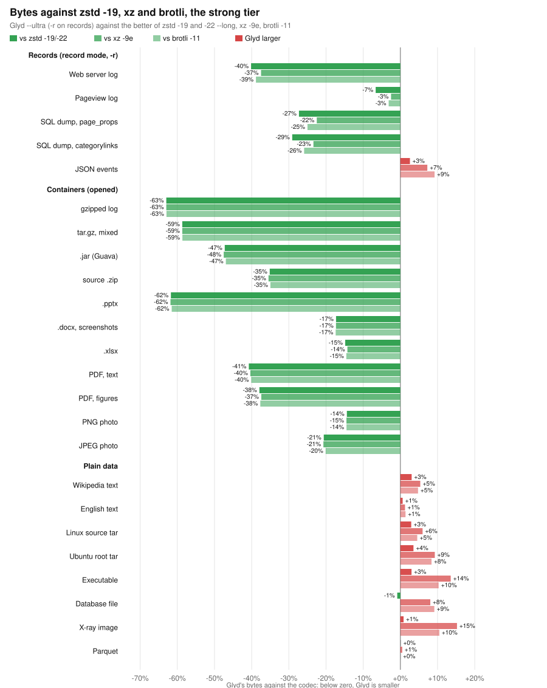
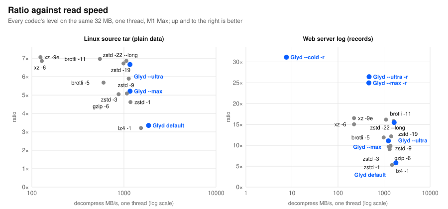

# Every codec on one machine against Glyd, 2026-09-22

zstd, xz, brotli, gzip, bzip2, lz4, zpaq and JPEG XL against Glyd's
levels on 24 kinds of data: bytes out, compress and decompress speed on
one thread, every decode compared byte for byte with its input (all 505
exact). Apple M1 Max, macOS 27.0; zstd 1.5.7, xz 5.8.4, brotli 1.2.0,
Apple gzip 487.0.1, bzip2 1.0.8, lz4 1.10.0, zpaq 7.15, cjxl 0.12.0;
Glyd from commit 4cd8ceb with `-s`. Text-like inputs are the first
32 MB of the file; containers and pictures are whole. Speeds are MB/s
of the original through each CLI, files read and written included;
four inputs were measured at once, each by one codec at a time.
Made by `scripts/landscape.py`; rows in
[`benchmarks/landscape/m1-max-2026-09-22/`](../../benchmarks/landscape/m1-max-2026-09-22/),
tables regenerated with `scripts/landscape.py --report rows.jsonl`.

**Smallest output of all 22 codec settings: Glyd on 17 of 24 inputs,
zpaq -m5 on the other 7** (by 0.4–11%, where Glyd `--cold -r` runs
1.3–3.4× faster).

## Charts

Against the codecs in general use (`scripts/landscape_charts.py`):

## Summary

Glyd's bytes against the other (minus: fewer bytes than it), and speeds on one thread, MB/s of the original.

| Data | Fast: Glyd --max vs zstd -3 (bytes; in; out) | Record mode: Glyd --max -r vs zstd -3 (bytes; in; out) | Strong: best Glyd vs best of zstd -19/-22, xz, brotli -11, bzip2 | Archival: Glyd --cold -r vs zpaq -m5 (bytes; in; out) | Smallest of all |
| :--- | :--- | :--- | :--- | :--- | :--- |
| Web server log (NASA) | -13%; 0.56×; 0.99× | -61%; 0.21×; 0.37× | -36% (--ultra -r 26.45 vs bzip2 -9 16.98) | -1%; 22×; 20× | Glyd --cold -r 31.14 |
| Pageview log (Wikimedia) | -2%; 0.81×; 1.06× | -12%; 0.32×; 0.41× | -3% (--ultra -r 5.04 vs xz -9e 4.91) | +0%; 3×; 3× | zpaq -m5 7.52 |
| Wikipedia XML text (enwik8) | -1%; 0.79×; 1.10× | – | +5% (--ultra 3.67 vs xz -9e 3.86) | +1%; 3×; 3× | zpaq -m5 5.04 |
| Executable (Silesia mozilla) | +1%; 0.75×; 1.20× | – | +14% (--ultra 3.14 vs xz -9e 3.56) | +9%; 3×; 3× | zpaq -m5 3.91 |
| gzipped log (NASA, gzip -6) | -60%; 0.00×; 0.01× | – | -63% (--ultra 2.70 vs brotli -11 1.00) | -68%; 2×; 4× | Glyd --cold -r 3.18 |
| Word, screenshots (.docx) | -8%; 0.01×; 0.02× | – | -17% (--ultra 1.21 vs zstd -19 1.00) | -34%; 0×; 0× | Glyd --cold -r 1.51 |
| PNG photo | -10%; 0.01×; 0.04× | – | -14% (--ultra 1.21 vs zstd -19 1.03) | -31%; 0×; 0× | Glyd --cold -r 1.54 |
| JSON events (GitHub Archive) | -18%; 0.68×; 1.11× | – | +9% (--ultra 14.96 vs brotli -11 16.33) | -5%; 3×; 3× | Glyd --cold -r 22.21 |
| English text (Silesia dickens) | -0%; 0.91×; 1.14× | – | +2% (--ultra 3.56 vs bzip2 -9 3.64) | -0%; 3×; 3× | Glyd --cold -r 4.87 |
| Database (Silesia osdb) | -0%; 0.74×; 1.18× | – | +10% (--ultra 3.28 vs bzip2 -9 3.60) | +6%; 2×; 2× | zpaq -m5 4.57 |
| Jar (Guava, 2,059 entries) | -35%; 0.02×; 0.04× | – | -47% (--ultra 2.14 vs brotli -11 1.14) | -59%; 1×; 1× | Glyd --cold -r 2.75 |
| Excel sheet (.xlsx) | -0%; 0.03×; 0.83× | – | -14% (--ultra 1.28 vs xz -6 1.10) | -60%; 1×; 1× | Glyd --cold -r 2.83 |
| JPEG photo | -21%; 0.02×; 0.02× | – | -20% (--ultra 1.27 vs brotli -11 1.02) | -18%; 18×; 35× | Glyd default 1.27 |
| SQL dump (Wikipedia page_props) | +1%; 0.71×; 1.14× | -32%; 0.33×; 0.57× | -22% (--ultra -r 8.64 vs xz -9e 6.69) | -7%; 5×; 4× | Glyd --cold -r 11.74 |
| Source tree tar (Linux 6.10) | -2%; 0.76×; 1.08× | – | +6% (--ultra 6.66 vs xz -9e 7.06) | -0%; 3×; 3× | Glyd --cold -r 9.44 |
| Medical image (Silesia x-ray) | +2%; 0.90×; 1.32× | – | +28% (--ultra 1.64 vs bzip2 -9 2.09) | +1%; 2×; 2× | zpaq -m5 2.31 |
| Source zip (GitHub) | -18%; 0.01×; 0.03× | – | -35% (--ultra 1.64 vs brotli -11 1.07) | -48%; 0×; 1× | Glyd --cold -r 2.04 |
| PDF paper (pdfTeX) | -33%; 0.01×; 0.02× | – | -40% (--ultra 3.59 vs brotli -11 2.15) | -51%; 0×; 1× | Glyd --cold -r 4.39 |
| tar.gz of mixed objects | -56%; 0.00×; 0.01× | – | -59% (--ultra 2.42 vs brotli -11 1.00) | -65%; 1×; 2× | Glyd --cold -r 2.90 |
| SQL dump (Simple Wikipedia categorylinks) | -2%; 0.73×; 0.90× | -38%; 0.25×; 0.47× | -23% (--ultra -r 15.87 vs xz -9e 12.15) | -0%; 11×; 9× | Glyd --cold -r 19.92 |
| OS image tar (Ubuntu root) | -2%; 0.36×; 1.02× | – | +9% (--ultra 3.46 vs xz -9e 3.78) | +11%; 1×; 3× | zpaq -m5 4.53 |
| Parquet (NYC taxi, zstd inside) | +0%; 1.13×; 0.91× | – | +1% (--ultra 1.02 vs xz -6 1.02) | +1%; 3×; 3× | zpaq -m5 1.05 |
| PowerPoint, text (.pptx) | -57%; 0.19×; 0.47× | – | -62% (--ultra 4.09 vs brotli -11 1.58) | -73%; 1×; 2× | Glyd --cold -r 5.79 |
| PDF paper with figures | -29%; 0.00×; 0.00× | – | -37% (--ultra 1.97 vs xz -6 1.23) | -48%; 0×; 0× | Glyd --cold -r 2.40 |

## Where Glyd leads, and why

- **Objects holding deflate streams** (gzip, zip and jar, Office files,
  PDF, PNG, tar.gz) **and JPEG**: 8–60% fewer bytes than zstd -3 at
  `--max` (the .xlsx: equal), 14–63% fewer than the best strong codec
  at `--ultra`, 18–73% fewer than zpaq -m5 at `--cold -r`. Glyd opens
  the stream, compresses the content, and re-creates the original
  deflate bit for bit on read; every other codec sees bytes that are
  already compressed. JPEG goes through Lepton: 1.272×, against 1.237×
  for JPEG XL's lossless JPEG mode.
- **Logs and table dumps, record mode** (`-r`): 12–61% fewer bytes than
  zstd -3 at `--max -r`, 3–36% fewer than the best strong codec at
  `--ultra -r`: each field becomes a typed column.
- **JSON events**: 18% fewer bytes than zstd -3 at `--max`.

## Where it does not, and why

- **Reading containers is slow.** `--max` compresses them at
  0.6–5.6 MB/s and reads them at 1.5–20 MB/s on one thread (zstd -3
  runs at hundreds of MB/s on the same files), because a read
  re-creates every deflate stream exactly: one full deflate
  compression per read. (The .xlsx at `--max` keeps its own deflate,
  so it reads at 221 MB/s.)
- **The default level opens containers too.** It spends 0.6–5.5 MB/s
  on them and on 8 of 11 then writes the closed form anyway (an
  LZ4-class level on the content loses to the file's own deflate); on
  the jar, the JPEG and the .pptx it keeps the opened form and reads
  at 9–20 MB/s, far from what the level is for. (Fixed after this run:
  from v0.13.2 the default, fast and turbo levels leave containers
  closed.)
- **Data without records or containers, fast tier**: `--max` is within
  2% of zstd -3's bytes (executable +1%, page_props +1%, x-ray +2%,
  Parquet ±0%), compresses at 0.36–0.91× its speed on one thread
  (Ubuntu tar 0.36×; Parquet 1.13×) and reads at 0.90–1.32×.
- **Same, strong fast-reading tier**: `--ultra` is 0.1–3.5% larger
  than the better of zstd -19 and -22 on 8 inputs (enwik8, dickens,
  JSON, mozilla, x-ray, the Linux and Ubuntu tars, Parquet). Its
  entropy stage (Huffman literals, table ANS for the sequences) is
  zstd's kind, so without records or containers it has no edge.
- **Against the slow-reading strong codecs** `--ultra` is larger on 9
  inputs: x-ray +28%, osdb +10%, dickens +2% (bzip2 -9); mozilla +14%,
  Ubuntu +9%, Linux +6%, enwik8 +5%, Parquet +0.5% (xz); JSON +9%
  (brotli -11). xz and bzip2 read those at 30–124 MB/s and brotli the
  JSON at 882, against `--ultra`'s 500–1,630: xz codes literals and
  matches with bit-level context models, bzip2 sorts by context
  (BWT), brotli -11 adds a built-in dictionary and context-modeled
  literals.
- **Archival**: zpaq -m5 is 0.4–11% smaller than `--cold -r` on 7
  inputs (Ubuntu +11%, mozilla +9%, osdb +6%) and 1.3–3.4× slower.
  `--cold` is an lpaq-style model (byte orders 1–6, the word, a match
  model) with no model yet for x86 code, binary tables or image
  samples.

## What closes each gap

1. Open containers only from `--max` up: the default level stays at
   full speed on them.
2. Container reads: streams inside one object already decode in
   parallel; a single stream's cost is the re-deflate itself.
3. `--ultra`: context-modeled literals and matches (LZMA's kind) for
   text and binaries, at some read speed.
4. `--cold`: models for x86 code, binary tables and image samples.
5. `--max` compress speed on one thread (0.36–0.91× zstd -3).

## Table

Web server log (NASA)

| Codec | Ratio | Compress MB/s | Decompress MB/s |
| :--- | ---: | ---: | ---: |
| **Glyd --cold -r** | 31.140 | 8.8 | 7.6 |
| zpaq -m5 | 30.956 | 0.4 | 0.4 |
| **Glyd --ultra -r** | 26.446 | 38.5 | 474.4 |
| **Glyd --max -r** | 24.976 | 137.1 | 468.4 |
| bzip2 -9 | 16.980 | 15.1 | 75.1 |
| xz -9e | 16.535 | 1.8 | 223.1 |
| brotli -11 | 16.170 | 0.8 | 1105.7 |
| zstd -22 --long | 15.827 | 1.7 | 1620.1 |
| zstd -19 | 15.627 | 2.8 | 1671.5 |
| **Glyd --ultra** | 15.484 | 2.9 | 1656.9 |
| xz -6 | 15.056 | 4.6 | 223.1 |
| zstd -9 | 12.169 | 129.4 | 1432.9 |
| brotli -5 | 11.897 | 126.2 | 983.7 |
| **Glyd --max** | 11.078 | 359.4 | 1245.9 |
| gzip -9 | 10.408 | 63.3 | 1352.3 |
| gzip -6 | 9.852 | 124.9 | 1378.3 |
| zstd -3 | 9.674 | 640.1 | 1260.6 |
| zstd -1 | 9.066 | 703.3 | 1324.0 |
| lz4 -9 | 8.301 | 484.3 | 1724.1 |
| **Glyd default** | 5.825 | 521.1 | 1807.9 |
| lz4 -1 | 5.313 | 889.0 | 1489.9 |

Pageview log (Wikimedia)

| Codec | Ratio | Compress MB/s | Decompress MB/s |
| :--- | ---: | ---: | ---: |
| zpaq -m5 | 7.519 | 0.4 | 0.3 |
| **Glyd --cold -r** | 7.487 | 1.2 | 1.0 |
| **Glyd --ultra -r** | 5.036 | 3.0 | 377.2 |
| xz -9e | 4.909 | 2.1 | 92.6 |
| brotli -11 | 4.877 | 0.7 | 392.3 |
| xz -6 | 4.847 | 2.8 | 91.3 |
| zstd -22 --long | 4.701 | 2.2 | 828.3 |
| zstd -19 | 4.654 | 2.8 | 822.5 |
| **Glyd --ultra** | 4.588 | 3.0 | 961.5 |
| bzip2 -9 | 4.235 | 19.3 | 50.7 |
| zstd -9 | 4.046 | 61.8 | 894.4 |
| **Glyd --max -r** | 3.925 | 90.1 | 342.9 |
| brotli -5 | 3.833 | 47.4 | 423.6 |
| **Glyd --max** | 3.548 | 226.8 | 882.2 |
| gzip -9 | 3.545 | 12.3 | 545.0 |
| gzip -6 | 3.509 | 35.3 | 591.7 |
| zstd -3 | 3.467 | 278.7 | 831.7 |
| zstd -1 | 3.181 | 425.1 | 1020.5 |
| lz4 -9 | 2.882 | 91.3 | 1380.4 |
| **Glyd default** | 2.283 | 213.8 | 1580.2 |
| lz4 -1 | 2.263 | 1115.3 | 1187.0 |

Wikipedia XML text (enwik8)

| Codec | Ratio | Compress MB/s | Decompress MB/s |
| :--- | ---: | ---: | ---: |
| zpaq -m5 | 5.036 | 0.3 | 0.3 |
| **Glyd --cold -r** | 4.975 | 0.9 | 0.9 |
| xz -9e | 3.863 | 1.5 | 81.9 |
| brotli -11 | 3.841 | 0.5 | 369.7 |
| zstd -22 --long | 3.778 | 1.6 | 740.5 |
| xz -6 | 3.765 | 1.8 | 83.2 |
| zstd -19 | 3.682 | 2.1 | 730.4 |
| **Glyd --ultra** | 3.666 | 1.8 | 759.9 |
| **Glyd --ultra -r** | 3.666 | 1.8 | 827.4 |
| bzip2 -9 | 3.446 | 18.4 | 42.1 |
| zstd -9 | 3.210 | 53.2 | 810.4 |
| brotli -5 | 2.990 | 39.5 | 376.9 |
| **Glyd --max** | 2.834 | 179.1 | 882.5 |
| **Glyd --max -r** | 2.834 | 173.2 | 904.3 |
| zstd -3 | 2.819 | 227.9 | 800.2 |
| gzip -9 | 2.732 | 24.7 | 559.1 |
| gzip -6 | 2.726 | 30.0 | 544.5 |
| zstd -1 | 2.451 | 400.8 | 926.2 |
| lz4 -9 | 2.360 | 222.2 | 1414.6 |
| **Glyd default** | 1.865 | 146.9 | 1784.7 |
| lz4 -1 | 1.739 | 1117.4 | 1501.5 |

Executable (Silesia mozilla)

| Codec | Ratio | Compress MB/s | Decompress MB/s |
| :--- | ---: | ---: | ---: |
| zpaq -m5 | 3.905 | 0.4 | 0.3 |
| **Glyd --cold -r** | 3.572 | 1.0 | 1.0 |
| xz -9e | 3.560 | 2.7 | 69.2 |
| xz -6 | 3.544 | 3.3 | 70.5 |
| brotli -11 | 3.458 | 0.4 | 285.9 |
| zstd -22 --long | 3.229 | 3.1 | 737.3 |
| zstd -19 | 3.211 | 3.9 | 672.6 |
| **Glyd --ultra** | 3.135 | 3.3 | 939.0 |
| **Glyd --ultra -r** | 3.135 | 3.3 | 945.5 |
| brotli -5 | 2.967 | 55.0 | 354.0 |
| zstd -9 | 2.928 | 76.4 | 936.1 |
| bzip2 -9 | 2.740 | 19.1 | 42.6 |
| zstd -3 | 2.703 | 333.8 | 900.5 |
| **Glyd --max** | 2.690 | 251.8 | 1079.9 |
| **Glyd --max -r** | 2.690 | 255.7 | 1067.0 |
| gzip -9 | 2.579 | 8.6 | 582.8 |
| gzip -6 | 2.573 | 32.1 | 575.5 |
| zstd -1 | 2.484 | 490.0 | 949.7 |
| lz4 -9 | 2.245 | 237.6 | 1591.0 |
| lz4 -1 | 1.897 | 1443.8 | 1590.7 |
| **Glyd default** | 1.891 | 307.1 | 1879.1 |

gzipped log (NASA, gzip -6)

| Codec | Ratio | Compress MB/s | Decompress MB/s |
| :--- | ---: | ---: | ---: |
| **Glyd --cold -r** | 3.181 | 0.4 | 0.9 |
| **Glyd --ultra** | 2.700 | 1.3 | 12.7 |
| **Glyd --ultra -r** | 2.700 | 1.3 | 12.6 |
| **Glyd --max** | 2.527 | 3.7 | 12.7 |
| **Glyd --max -r** | 2.527 | 3.8 | 12.6 |
| zpaq -m5 | 1.003 | 0.2 | 0.2 |
| brotli -11 | 1.001 | 0.5 | 279.7 |
| lz4 -1 | 1.000 | 1277.9 | 1656.9 |
| lz4 -9 | 1.000 | 232.5 | 1704.1 |
| brotli -5 | 1.000 | 570.4 | 1751.2 |
| zstd -1 | 1.000 | 1558.5 | 2270.6 |
| zstd -3 | 1.000 | 1390.1 | 2084.8 |
| zstd -9 | 1.000 | 924.6 | 2185.7 |
| zstd -19 | 1.000 | 7.8 | 2084.8 |
| zstd -22 --long | 1.000 | 9.6 | 2242.6 |
| xz -6 | 1.000 | 3.1 | 441.6 |
| xz -9e | 1.000 | 3.9 | 424.2 |
| **Glyd default** | 1.000 | 4.5 | 2002.0 |
| gzip -6 | 1.000 | 53.3 | 1446.6 |
| gzip -9 | 1.000 | 53.4 | 1537.3 |
| bzip2 -9 | 0.996 | 11.0 | 20.3 |

Word, screenshots (.docx)

| Codec | Ratio | Compress MB/s | Decompress MB/s |
| :--- | ---: | ---: | ---: |
| **Glyd --cold -r** | 1.515 | 0.1 | 0.1 |
| **Glyd --ultra** | 1.211 | 0.4 | 9.6 |
| **Glyd --ultra -r** | 1.211 | 0.4 | 9.8 |
| **Glyd --max** | 1.090 | 2.8 | 9.7 |
| **Glyd --max -r** | 1.090 | 2.8 | 9.5 |
| zpaq -m5 | 1.002 | 0.3 | 0.3 |
| zstd -19 | 1.001 | 16.1 | 434.9 |
| zstd -22 --long | 1.001 | 9.4 | 471.9 |
| xz -9e | 1.001 | 5.8 | 203.3 |
| xz -6 | 1.001 | 5.6 | 201.2 |
| gzip -6 | 1.001 | 50.7 | 606.1 |
| gzip -9 | 1.001 | 51.3 | 637.1 |
| zstd -9 | 1.000 | 320.4 | 422.2 |
| zstd -3 | 1.000 | 398.2 | 499.4 |
| **Glyd default** | 1.000 | 2.8 | 473.2 |
| brotli -5 | 1.000 | 220.3 | 483.5 |
| brotli -11 | 1.000 | 1.6 | 495.0 |
| lz4 -1 | 1.000 | 343.6 | 468.2 |
| lz4 -9 | 1.000 | 49.6 | 485.6 |
| zstd -1 | 1.000 | 238.5 | 471.4 |
| bzip2 -9 | 0.996 | 11.5 | 21.7 |

PNG photo

| Codec | Ratio | Compress MB/s | Decompress MB/s |
| :--- | ---: | ---: | ---: |
| **Glyd --cold -r** | 1.538 | 0.1 | 0.1 |
| **Glyd --ultra** | 1.208 | 0.4 | 14.6 |
| **Glyd --ultra -r** | 1.208 | 0.4 | 14.7 |
| **Glyd --max** | 1.113 | 3.6 | 14.6 |
| **Glyd --max -r** | 1.113 | 3.6 | 14.6 |
| zpaq -m5 | 1.061 | 0.3 | 0.3 |
| zstd -19 | 1.035 | 12.6 | 275.5 |
| zstd -22 --long | 1.035 | 7.5 | 287.4 |
| brotli -11 | 1.033 | 0.4 | 97.9 |
| xz -6 | 1.033 | 6.0 | 26.2 |
| xz -9e | 1.033 | 5.5 | 26.6 |
| bzip2 -9 | 1.031 | 11.9 | 22.0 |
| gzip -6 | 1.013 | 40.4 | 216.7 |
| gzip -9 | 1.013 | 39.8 | 222.9 |
| lz4 -9 | 1.007 | 47.8 | 351.6 |
| brotli -5 | 1.000 | 198.2 | 391.5 |
| lz4 -1 | 1.000 | 309.2 | 366.8 |
| zstd -1 | 1.000 | 303.4 | 351.9 |
| zstd -3 | 1.000 | 254.7 | 390.9 |
| zstd -9 | 1.000 | 101.8 | 342.2 |
| **Glyd default** | 1.000 | 3.7 | 382.8 |

JSON events (GitHub Archive)

| Codec | Ratio | Compress MB/s | Decompress MB/s |
| :--- | ---: | ---: | ---: |
| **Glyd --cold -r** | 22.213 | 1.2 | 1.2 |
| zpaq -m5 | 21.141 | 0.4 | 0.4 |
| brotli -11 | 16.333 | 1.0 | 882.1 |
| xz -9e | 16.041 | 4.1 | 192.4 |
| zstd -22 --long | 15.342 | 2.9 | 1516.8 |
| **Glyd --ultra** | 14.955 | 3.0 | 1634.9 |
| **Glyd --ultra -r** | 14.955 | 3.0 | 1266.3 |
| zstd -19 | 14.341 | 5.0 | 1656.4 |
| xz -6 | 14.257 | 6.7 | 187.5 |
| **Glyd --max** | 12.330 | 459.5 | 1569.9 |
| **Glyd --max -r** | 12.330 | 330.3 | 1571.2 |
| zstd -9 | 12.018 | 166.5 | 1418.4 |
| brotli -5 | 11.897 | 146.2 | 956.2 |
| zstd -3 | 10.130 | 676.0 | 1418.6 |
| bzip2 -9 | 10.110 | 13.5 | 59.0 |
| zstd -1 | 8.624 | 797.3 | 1419.2 |
| gzip -9 | 7.197 | 68.0 | 1076.3 |
| gzip -6 | 7.124 | 93.5 | 1067.1 |
| lz4 -9 | 6.281 | 133.3 | 1035.9 |
| **Glyd default** | 5.395 | 523.0 | 1896.8 |
| lz4 -1 | 4.872 | 1133.5 | 1594.8 |

English text (Silesia dickens)

| Codec | Ratio | Compress MB/s | Decompress MB/s |
| :--- | ---: | ---: | ---: |
| **Glyd --cold -r** | 4.871 | 0.9 | 0.9 |
| zpaq -m5 | 4.866 | 0.3 | 0.3 |
| bzip2 -9 | 3.641 | 17.1 | 36.0 |
| brotli -11 | 3.604 | 0.6 | 349.8 |
| xz -9e | 3.600 | 1.7 | 86.1 |
| xz -6 | 3.599 | 1.7 | 85.8 |
| zstd -22 --long | 3.577 | 1.6 | 601.5 |
| zstd -19 | 3.576 | 1.8 | 589.2 |
| **Glyd --ultra** | 3.555 | 1.8 | 734.8 |
| **Glyd --ultra -r** | 3.506 | 1.9 | 760.6 |
| zstd -9 | 3.105 | 43.8 | 597.3 |
| brotli -5 | 2.858 | 30.5 | 324.2 |
| **Glyd --max** | 2.786 | 159.2 | 681.8 |
| zstd -3 | 2.781 | 175.1 | 596.6 |
| **Glyd --max -r** | 2.777 | 142.2 | 706.8 |
| gzip -9 | 2.644 | 17.4 | 507.6 |
| gzip -6 | 2.633 | 22.4 | 495.8 |
| zstd -1 | 2.391 | 305.7 | 706.9 |
| lz4 -9 | 2.295 | 59.3 | 950.2 |
| **Glyd default** | 1.815 | 118.4 | 1181.5 |
| lz4 -1 | 1.585 | 563.3 | 897.0 |

Database (Silesia osdb)

| Codec | Ratio | Compress MB/s | Decompress MB/s |
| :--- | ---: | ---: | ---: |
| zpaq -m5 | 4.575 | 0.3 | 0.3 |
| **Glyd --cold -r** | 4.324 | 0.8 | 0.8 |
| bzip2 -9 | 3.598 | 19.0 | 32.3 |
| brotli -11 | 3.581 | 0.7 | 304.4 |
| xz -9e | 3.546 | 2.8 | 70.2 |
| xz -6 | 3.539 | 2.9 | 68.0 |
| **Glyd --ultra** | 3.281 | 2.8 | 882.5 |
| **Glyd --ultra -r** | 3.259 | 3.2 | 889.6 |
| zstd -22 --long | 3.254 | 2.9 | 688.2 |
| zstd -19 | 3.253 | 3.3 | 681.6 |
| zstd -9 | 3.017 | 68.9 | 719.8 |
| brotli -5 | 2.996 | 56.7 | 367.7 |
| **Glyd --max** | 2.895 | 206.5 | 895.8 |
| **Glyd --max -r** | 2.890 | 218.0 | 876.1 |
| zstd -3 | 2.880 | 280.7 | 760.7 |
| gzip -9 | 2.746 | 35.8 | 556.3 |
| gzip -6 | 2.729 | 46.4 | 561.5 |
| zstd -1 | 2.705 | 420.8 | 796.9 |
| lz4 -9 | 2.529 | 138.8 | 987.8 |
| **Glyd default** | 2.294 | 311.6 | 1250.1 |
| lz4 -1 | 1.917 | 709.0 | 982.6 |

Jar (Guava, 2,059 entries)

| Codec | Ratio | Compress MB/s | Decompress MB/s |
| :--- | ---: | ---: | ---: |
| **Glyd --cold -r** | 2.748 | 0.3 | 0.4 |
| **Glyd --ultra** | 2.144 | 1.0 | 19.4 |
| **Glyd --ultra -r** | 2.144 | 1.0 | 19.6 |
| **Glyd --max** | 1.729 | 5.6 | 19.9 |
| **Glyd --max -r** | 1.729 | 5.6 | 19.5 |
| **Glyd default** | 1.166 | 5.5 | 19.9 |
| zpaq -m5 | 1.137 | 0.3 | 0.3 |
| brotli -11 | 1.137 | 0.5 | 126.4 |
| zstd -19 | 1.131 | 11.1 | 495.1 |
| zstd -22 --long | 1.131 | 7.1 | 414.2 |
| zstd -9 | 1.129 | 116.1 | 493.1 |
| xz -9e | 1.125 | 5.2 | 29.7 |
| xz -6 | 1.125 | 5.9 | 29.9 |
| brotli -5 | 1.119 | 102.4 | 212.8 |
| bzip2 -9 | 1.117 | 12.0 | 22.4 |
| zstd -3 | 1.116 | 258.4 | 519.5 |
| gzip -9 | 1.115 | 43.6 | 295.5 |
| gzip -6 | 1.114 | 47.8 | 284.5 |
| lz4 -9 | 1.113 | 52.7 | 506.7 |
| zstd -1 | 1.112 | 375.7 | 536.0 |
| lz4 -1 | 1.100 | 398.6 | 564.7 |

Excel sheet (.xlsx)

| Codec | Ratio | Compress MB/s | Decompress MB/s |
| :--- | ---: | ---: | ---: |
| **Glyd --cold -r** | 2.833 | 0.2 | 0.2 |
| **Glyd --ultra** | 1.279 | 0.2 | 13.8 |
| **Glyd --ultra -r** | 1.279 | 0.2 | 13.6 |
| zpaq -m5 | 1.132 | 0.3 | 0.3 |
| xz -6 | 1.096 | 5.9 | 26.9 |
| xz -9e | 1.096 | 5.5 | 27.1 |
| brotli -11 | 1.093 | 0.6 | 88.9 |
| zstd -19 | 1.089 | 11.0 | 222.3 |
| zstd -22 --long | 1.089 | 6.0 | 192.7 |
| bzip2 -9 | 1.073 | 12.5 | 21.2 |
| zstd -9 | 1.047 | 76.2 | 242.1 |
| gzip -6 | 1.033 | 35.5 | 192.4 |
| gzip -9 | 1.033 | 36.1 | 186.0 |
| brotli -5 | 1.032 | 64.1 | 120.6 |
| lz4 -9 | 1.021 | 46.7 | 287.0 |
| **Glyd --max** | 1.012 | 4.4 | 221.2 |
| **Glyd --max -r** | 1.012 | 4.5 | 254.0 |
| zstd -3 | 1.010 | 160.5 | 264.9 |
| lz4 -1 | 1.000 | 246.2 | 289.0 |
| zstd -1 | 1.000 | 194.7 | 284.3 |
| **Glyd default** | 1.000 | 4.7 | 281.8 |

JPEG photo

| Codec | Ratio | Compress MB/s | Decompress MB/s |
| :--- | ---: | ---: | ---: |
| **Glyd default** | 1.272 | 4.7 | 9.1 |
| **Glyd --max** | 1.272 | 4.7 | 9.0 |
| **Glyd --max -r** | 1.272 | 4.7 | 9.0 |
| **Glyd --ultra** | 1.272 | 4.7 | 9.0 |
| **Glyd --ultra -r** | 1.272 | 4.7 | 9.0 |
| **Glyd --cold -r** | 1.272 | 4.7 | 9.0 |
| JPEG XL (lossless JPEG) | 1.237 | 7.8 | 13.3 |
| zpaq -m5 | 1.040 | 0.3 | 0.3 |
| brotli -11 | 1.017 | 0.5 | 99.2 |
| bzip2 -9 | 1.016 | 11.9 | 21.8 |
| zstd -19 | 1.010 | 13.9 | 324.6 |
| zstd -22 --long | 1.010 | 8.4 | 361.7 |
| xz -6 | 1.009 | 5.7 | 71.2 |
| xz -9e | 1.009 | 5.8 | 68.2 |
| gzip -9 | 1.008 | 42.8 | 331.0 |
| gzip -6 | 1.008 | 43.7 | 304.1 |
| zstd -9 | 1.006 | 227.5 | 347.5 |
| zstd -1 | 1.005 | 280.0 | 402.3 |
| zstd -3 | 1.005 | 248.5 | 388.5 |
| lz4 -9 | 1.003 | 48.4 | 407.8 |
| lz4 -1 | 1.001 | 315.9 | 416.0 |
| brotli -5 | 1.000 | 265.6 | 439.9 |

SQL dump (Wikipedia page_props)

| Codec | Ratio | Compress MB/s | Decompress MB/s |
| :--- | ---: | ---: | ---: |
| **Glyd --cold -r** | 11.740 | 2.0 | 1.7 |
| zpaq -m5 | 10.911 | 0.4 | 0.4 |
| **Glyd --ultra -r** | 8.636 | 5.0 | 538.6 |
| xz -9e | 6.694 | 0.5 | 111.0 |
| **Glyd --max -r** | 6.626 | 114.6 | 566.4 |
| xz -6 | 6.477 | 2.7 | 110.1 |
| brotli -11 | 6.477 | 0.6 | 503.4 |
| zstd -22 --long | 6.280 | 0.5 | 931.3 |
| bzip2 -9 | 6.210 | 17.3 | 48.7 |
| zstd -19 | 6.122 | 2.0 | 938.8 |
| **Glyd --ultra** | 6.070 | 2.4 | 1160.5 |
| zstd -9 | 5.174 | 72.5 | 1026.0 |
| brotli -5 | 4.946 | 62.6 | 550.6 |
| zstd -3 | 4.520 | 342.2 | 991.3 |
| **Glyd --max** | 4.492 | 243.2 | 1127.2 |
| gzip -9 | 4.479 | 27.1 | 750.6 |
| gzip -6 | 4.391 | 61.5 | 772.4 |
| zstd -1 | 4.249 | 518.0 | 1092.5 |
| lz4 -9 | 3.685 | 104.4 | 1563.5 |
| **Glyd default** | 3.072 | 279.1 | 1833.4 |
| lz4 -1 | 2.877 | 949.3 | 1427.4 |

Source tree tar (Linux 6.10)

| Codec | Ratio | Compress MB/s | Decompress MB/s |
| :--- | ---: | ---: | ---: |
| **Glyd --cold -r** | 9.442 | 1.1 | 1.0 |
| zpaq -m5 | 9.399 | 0.4 | 0.4 |
| xz -9e | 7.059 | 2.0 | 124.0 |
| brotli -11 | 6.963 | 0.7 | 548.4 |
| zstd -22 --long | 6.855 | 1.8 | 1062.9 |
| xz -6 | 6.853 | 3.4 | 128.3 |
| zstd -19 | 6.718 | 3.1 | 988.6 |
| **Glyd --ultra** | 6.660 | 3.0 | 1161.9 |
| **Glyd --ultra -r** | 6.660 | 3.0 | 1189.5 |
| bzip2 -9 | 6.344 | 21.0 | 49.2 |
| zstd -9 | 5.894 | 81.2 | 1126.4 |
| brotli -5 | 5.679 | 69.3 | 600.3 |
| **Glyd --max** | 5.210 | 268.7 | 1165.7 |
| **Glyd --max -r** | 5.210 | 273.7 | 1210.0 |
| gzip -9 | 5.108 | 23.1 | 847.6 |
| zstd -3 | 5.085 | 355.6 | 1075.8 |
| gzip -6 | 5.046 | 55.0 | 875.6 |
| zstd -1 | 4.617 | 507.9 | 1176.5 |
| lz4 -9 | 4.359 | 236.5 | 1558.7 |
| **Glyd default** | 3.349 | 256.5 | 1852.6 |
| lz4 -1 | 3.209 | 1221.4 | 1530.0 |

Medical image (Silesia x-ray)

| Codec | Ratio | Compress MB/s | Decompress MB/s |
| :--- | ---: | ---: | ---: |
| zpaq -m5 | 2.309 | 0.3 | 0.3 |
| **Glyd --cold -r** | 2.284 | 0.8 | 0.8 |
| bzip2 -9 | 2.092 | 19.2 | 30.4 |
| xz -6 | 1.887 | 2.7 | 36.8 |
| xz -9e | 1.887 | 3.1 | 36.1 |
| brotli -11 | 1.810 | 0.5 | 122.7 |
| zstd -19 | 1.652 | 3.2 | 408.6 |
| zstd -22 --long | 1.652 | 2.9 | 419.1 |
| **Glyd --ultra** | 1.638 | 3.1 | 500.5 |
| **Glyd --ultra -r** | 1.636 | 3.1 | 551.8 |
| zstd -9 | 1.581 | 51.9 | 405.0 |
| brotli -5 | 1.493 | 36.2 | 178.0 |
| gzip -9 | 1.402 | 29.8 | 318.5 |
| gzip -6 | 1.402 | 29.8 | 316.1 |
| zstd -3 | 1.392 | 169.1 | 491.1 |
| **Glyd --max** | 1.369 | 152.2 | 645.8 |
| **Glyd --max -r** | 1.368 | 160.7 | 661.9 |
| zstd -1 | 1.251 | 449.7 | 594.5 |
| lz4 -9 | 1.180 | 95.4 | 775.0 |
| lz4 -1 | 1.008 | 736.9 | 962.0 |
| **Glyd default** | 1.000 | 879.5 | 1223.0 |

Source zip (GitHub)

| Codec | Ratio | Compress MB/s | Decompress MB/s |
| :--- | ---: | ---: | ---: |
| **Glyd --cold -r** | 2.038 | 0.1 | 0.1 |
| **Glyd --ultra** | 1.638 | 0.6 | 10.0 |
| **Glyd --ultra -r** | 1.638 | 0.6 | 10.0 |
| **Glyd --max** | 1.291 | 3.4 | 10.0 |
| **Glyd --max -r** | 1.291 | 3.3 | 9.9 |
| brotli -11 | 1.066 | 0.5 | 118.8 |
| zpaq -m5 | 1.065 | 0.3 | 0.3 |
| zstd -19 | 1.063 | 12.9 | 382.9 |
| zstd -22 --long | 1.063 | 9.0 | 495.5 |
| xz -6 | 1.057 | 6.1 | 59.2 |
| xz -9e | 1.057 | 5.6 | 59.1 |
| zstd -3 | 1.056 | 246.8 | 296.0 |
| brotli -5 | 1.046 | 120.3 | 212.4 |
| **Glyd default** | 1.045 | 3.4 | 520.6 |
| zstd -9 | 1.043 | 168.7 | 435.9 |
| bzip2 -9 | 1.040 | 11.2 | 17.5 |
| zstd -1 | 1.036 | 312.3 | 372.2 |
| gzip -9 | 1.036 | 47.3 | 368.7 |
| gzip -6 | 1.036 | 48.9 | 353.2 |
| lz4 -9 | 1.033 | 50.8 | 488.3 |
| lz4 -1 | 1.027 | 424.1 | 575.2 |

PDF paper (pdfTeX)

| Codec | Ratio | Compress MB/s | Decompress MB/s |
| :--- | ---: | ---: | ---: |
| **Glyd --cold -r** | 4.392 | 0.1 | 0.2 |
| **Glyd --ultra** | 3.594 | 0.5 | 6.8 |
| **Glyd --ultra -r** | 3.594 | 0.5 | 6.8 |
| **Glyd --max** | 3.025 | 2.4 | 6.8 |
| **Glyd --max -r** | 3.025 | 2.4 | 6.8 |
| zpaq -m5 | 2.167 | 0.3 | 0.3 |
| brotli -11 | 2.153 | 0.7 | 171.5 |
| xz -9e | 2.144 | 3.3 | 52.1 |
| xz -6 | 2.141 | 6.7 | 53.2 |
| zstd -22 --long | 2.129 | 3.1 | 330.1 |
| zstd -19 | 2.129 | 5.0 | 329.0 |
| brotli -5 | 2.069 | 95.0 | 226.2 |
| zstd -9 | 2.057 | 119.1 | 389.5 |
| zstd -3 | 2.016 | 250.7 | 353.8 |
| bzip2 -9 | 1.973 | 13.3 | 32.4 |
| gzip -9 | 1.955 | 36.0 | 308.1 |
| zstd -1 | 1.951 | 258.3 | 398.4 |
| gzip -6 | 1.944 | 55.5 | 320.5 |
| lz4 -9 | 1.885 | 59.4 | 331.7 |
| lz4 -1 | 1.795 | 301.2 | 425.6 |
| **Glyd default** | 1.774 | 2.5 | 452.2 |

tar.gz of mixed objects

| Codec | Ratio | Compress MB/s | Decompress MB/s |
| :--- | ---: | ---: | ---: |
| **Glyd --cold -r** | 2.899 | 0.3 | 0.5 |
| **Glyd --ultra** | 2.419 | 1.1 | 11.3 |
| **Glyd --ultra -r** | 2.419 | 1.1 | 10.9 |
| **Glyd --max** | 2.250 | 3.2 | 11.2 |
| **Glyd --max -r** | 2.250 | 3.2 | 11.3 |
| zpaq -m5 | 1.002 | 0.3 | 0.3 |
| brotli -11 | 1.001 | 0.6 | 368.9 |
| lz4 -1 | 1.000 | 1273.2 | 1814.3 |
| lz4 -9 | 1.000 | 221.0 | 1742.4 |
| brotli -5 | 1.000 | 543.9 | 1905.4 |
| zstd -1 | 1.000 | 1662.2 | 2260.2 |
| zstd -3 | 1.000 | 1437.3 | 2071.0 |
| zstd -9 | 1.000 | 864.3 | 2070.8 |
| zstd -19 | 1.000 | 7.5 | 2225.0 |
| zstd -22 --long | 1.000 | 9.5 | 2324.2 |
| xz -6 | 1.000 | 3.1 | 446.6 |
| xz -9e | 1.000 | 3.8 | 431.6 |
| **Glyd default** | 1.000 | 3.8 | 2040.6 |
| gzip -6 | 1.000 | 53.2 | 1821.3 |
| gzip -9 | 1.000 | 51.3 | 1902.2 |
| bzip2 -9 | 0.995 | 11.0 | 18.4 |

SQL dump (Simple Wikipedia categorylinks)

| Codec | Ratio | Compress MB/s | Decompress MB/s |
| :--- | ---: | ---: | ---: |
| **Glyd --cold -r** | 19.920 | 4.7 | 3.9 |
| zpaq -m5 | 19.867 | 0.4 | 0.4 |
| **Glyd --ultra -r** | 15.865 | 15.5 | 642.9 |
| **Glyd --max -r** | 13.671 | 134.0 | 612.5 |
| xz -9e | 12.154 | 1.1 | 169.5 |
| brotli -11 | 11.757 | 0.6 | 739.9 |
| xz -6 | 11.469 | 4.3 | 166.3 |
| zstd -22 --long | 11.251 | 1.0 | 1141.7 |
| zstd -19 | 11.086 | 2.4 | 1287.4 |
| **Glyd --ultra** | 10.910 | 2.8 | 1425.5 |
| bzip2 -9 | 9.706 | 15.0 | 68.9 |
| zstd -9 | 9.643 | 119.8 | 1335.3 |
| brotli -5 | 9.272 | 105.9 | 766.7 |
| **Glyd --max** | 8.737 | 383.1 | 1188.1 |
| zstd -3 | 8.524 | 526.6 | 1313.7 |
| gzip -9 | 8.213 | 45.8 | 855.8 |
| zstd -1 | 8.166 | 714.7 | 1327.0 |
| gzip -6 | 8.102 | 93.9 | 962.5 |
| lz4 -9 | 6.570 | 152.7 | 1183.8 |
| **Glyd default** | 5.534 | 465.2 | 1764.3 |
| lz4 -1 | 5.423 | 1145.6 | 1634.6 |

OS image tar (Ubuntu root)

| Codec | Ratio | Compress MB/s | Decompress MB/s |
| :--- | ---: | ---: | ---: |
| zpaq -m5 | 4.527 | 0.4 | 0.4 |
| **Glyd --cold -r** | 4.094 | 0.5 | 0.9 |
| xz -9e | 3.776 | 2.3 | 73.8 |
| brotli -11 | 3.745 | 0.5 | 278.6 |
| xz -6 | 3.715 | 3.2 | 72.7 |
| zstd -22 --long | 3.578 | 2.2 | 720.1 |
| zstd -19 | 3.512 | 3.5 | 713.0 |
| **Glyd --ultra** | 3.456 | 1.3 | 905.2 |
| **Glyd --ultra -r** | 3.456 | 1.3 | 921.4 |
| zstd -9 | 3.178 | 71.7 | 831.3 |
| brotli -5 | 3.107 | 52.9 | 332.1 |
| **Glyd --max** | 2.891 | 111.4 | 890.4 |
| **Glyd --max -r** | 2.891 | 112.4 | 884.1 |
| zstd -3 | 2.842 | 308.9 | 875.2 |
| bzip2 -9 | 2.770 | 18.3 | 34.9 |
| gzip -9 | 2.478 | 8.7 | 520.7 |
| gzip -6 | 2.469 | 28.8 | 534.4 |
| zstd -1 | 2.245 | 494.5 | 901.0 |
| lz4 -9 | 2.175 | 183.7 | 1595.2 |
| lz4 -1 | 1.795 | 1302.5 | 1540.8 |
| **Glyd default** | 1.725 | 137.2 | 1860.1 |

Parquet (NYC taxi, zstd inside)

| Codec | Ratio | Compress MB/s | Decompress MB/s |
| :--- | ---: | ---: | ---: |
| zpaq -m5 | 1.045 | 0.3 | 0.3 |
| **Glyd --cold -r** | 1.036 | 0.8 | 0.8 |
| xz -6 | 1.022 | 2.9 | 45.0 |
| xz -9e | 1.021 | 3.4 | 45.5 |
| zstd -19 | 1.018 | 6.8 | 1640.9 |
| zstd -22 --long | 1.018 | 7.6 | 1458.6 |
| brotli -11 | 1.017 | 0.5 | 256.4 |
| **Glyd --ultra** | 1.017 | 3.1 | 1431.7 |
| **Glyd --ultra -r** | 1.017 | 3.1 | 1595.8 |
| gzip -6 | 1.015 | 45.9 | 576.8 |
| gzip -9 | 1.015 | 45.9 | 561.7 |
| bzip2 -9 | 1.008 | 11.8 | 22.1 |
| zstd -3 | 1.004 | 780.1 | 2389.0 |
| zstd -1 | 1.003 | 1255.6 | 2519.2 |
| zstd -9 | 1.002 | 696.6 | 2564.8 |
| **Glyd --max** | 1.001 | 885.2 | 2183.9 |
| **Glyd --max -r** | 1.001 | 916.9 | 2194.9 |
| lz4 -1 | 1.000 | 1882.7 | 2246.3 |
| lz4 -9 | 1.000 | 265.7 | 2256.8 |
| brotli -5 | 1.000 | 589.3 | 2325.4 |
| **Glyd default** | 1.000 | 1472.4 | 2317.3 |

PowerPoint, text (.pptx)

| Codec | Ratio | Compress MB/s | Decompress MB/s |
| :--- | ---: | ---: | ---: |
| **Glyd --cold -r** | 5.789 | 0.3 | 0.5 |
| **Glyd --ultra** | 4.095 | 0.7 | 9.6 |
| **Glyd --ultra -r** | 4.095 | 0.7 | 9.5 |
| **Glyd --max** | 3.570 | 3.7 | 9.3 |
| **Glyd --max -r** | 3.570 | 3.7 | 9.0 |
| **Glyd default** | 2.532 | 3.6 | 9.0 |
| brotli -11 | 1.576 | 0.3 | 16.4 |
| zstd -19 | 1.567 | 2.6 | 17.6 |
| zstd -22 --long | 1.567 | 0.9 | 18.7 |
| xz -9e | 1.562 | 3.4 | 12.9 |
| xz -6 | 1.562 | 4.9 | 13.3 |
| zstd -9 | 1.551 | 13.0 | 17.6 |
| zstd -3 | 1.543 | 19.2 | 19.6 |
| zpaq -m5 | 1.539 | 0.3 | 0.3 |
| brotli -5 | 1.539 | 11.6 | 18.7 |
| zstd -1 | 1.535 | 16.7 | 18.2 |
| gzip -6 | 1.521 | 18.4 | 24.1 |
| gzip -9 | 1.521 | 18.3 | 29.5 |
| lz4 -9 | 1.513 | 18.9 | 23.2 |
| bzip2 -9 | 1.490 | 8.8 | 13.6 |
| lz4 -1 | 1.459 | 18.2 | 21.9 |

PDF paper with figures

| Codec | Ratio | Compress MB/s | Decompress MB/s |
| :--- | ---: | ---: | ---: |
| **Glyd --cold -r** | 2.403 | 0.0 | 0.0 |
| **Glyd --ultra** | 1.968 | 0.0 | 1.5 |
| **Glyd --ultra -r** | 1.968 | 0.0 | 1.6 |
| **Glyd --max** | 1.615 | 0.6 | 1.5 |
| **Glyd --max -r** | 1.615 | 0.5 | 1.5 |
| zpaq -m5 | 1.250 | 0.3 | 0.3 |
| xz -6 | 1.232 | 4.6 | 33.5 |
| xz -9e | 1.232 | 5.0 | 33.7 |
| brotli -11 | 1.227 | 0.4 | 126.8 |
| zstd -22 --long | 1.222 | 7.3 | 582.3 |
| zstd -19 | 1.222 | 8.6 | 602.7 |
| bzip2 -9 | 1.181 | 12.7 | 22.6 |
| zstd -9 | 1.176 | 97.8 | 893.6 |
| gzip -9 | 1.171 | 37.4 | 342.1 |
| gzip -6 | 1.170 | 44.6 | 351.7 |
| brotli -5 | 1.159 | 81.8 | 242.7 |
| zstd -3 | 1.153 | 252.1 | 931.0 |
| lz4 -9 | 1.153 | 85.1 | 763.9 |
| zstd -1 | 1.127 | 479.7 | 1071.3 |
| lz4 -1 | 1.122 | 667.1 | 917.0 |
| **Glyd default** | 1.102 | 0.6 | 1051.3 |

## Inputs

Text-like (first 32 MB): the benchmark corpus (`scripts/download_bench_corpus.sh`)
and Silesia. Whole files, by SHA-256 prefix:

| Input | Bytes | Made from | SHA-256 |
| :--- | ---: | :--- | :--- |
| gzipped log | 20,695,694 | `gzip -6` of the NASA log | 2b9c961a2e7d09a6 |
| Jar | 3,051,356 | Maven Central guava-33.2.1-jre.jar | 452b2d9787b7d366 |
| Source zip | 2,727,058 | GitHub archive of facebook/zstd v1.5.6 | 3b1c3b46e416d369 |
| PowerPoint | 88,069 | python-pptx, 60 text slides | 7a6779bc86a4b471 |
| Word | 2,506,931 | python-docx, six PNG screenshots | 3b5940ec280cb7ad |
| Excel | 1,343,806 | openpyxl, 30,000 rows of request metrics | c599f926c39848c7 |
| PDF paper | 2,215,244 | arXiv 1706.03762 | bdfaa68d8984f0dc |
| PDF with figures | 6,768,044 | arXiv 2005.14165 | 97fd272f1fdfc186 |
| PNG photo | 1,826,262 | a photograph | df65b9b296308571 |
| JPEG photo | 2,136,653 | a photograph | cf1a96c1fd87976b |
| tar.gz | 22,899,824 | `gzip -6` of a tar of a .log.gz, a PDF, a PNG and a .docx | 0164bda5a5862554 |
